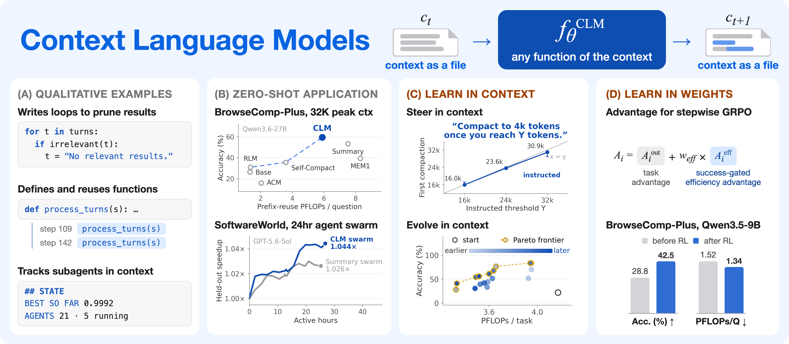

# Context Language Models：让模型直接维护自己的上下文文件

作者：Shao, Rulin、Shen, Shannon Zejiang、Yin, Junjie Oscar、Li, Yuetai、Wang, Minheng、Ivison, Hamish、Poovendran, Radha、Lambert, Nathan、Xiao, Teng、Lewis, Mike、Yih, Wen-tau、Zettlemoyer, Luke、Koh, Pang Wei。arXiv:2609.37725 v1，提交2026-09-29。预印本。

新近创新 / 新近实用；热度待验证。已读核心原文，本站未训练复现。

CLM把当前上下文映射成一个文件，模型可以用普通文件工具删改、整理，再同步回下一轮推理。没有编辑时仍然追加新内容。这比只能调用预设“压缩”按钮更自由，也允许不同任务维护不同的笔记、追踪表或外部引用。

作者先用32K上下文的合成ContextBench检查精确保留、局部修改和卸载检索，再测试研究、编码和长程任务。Qwen3.5-9B经强化学习后，BrowseComp-Plus从28.8%到42.5%；与同配方训练的摘要框架相比高0.4个百分点，同时少38.8%的prefix-reuse FLOPs。不能把相对自身未训练的提升全部归因于文件接口。

这里的FLOPs计入上下文中途编辑带来的重新预填充，仍是计算量指标，不等于实际延迟或账单节省。另提出Suffix Cache Reuse进一步复用后缀缓存，需要服务端配合。为什么现在值得看：长程Agent的记忆管理有了可训练、可比较的实现方式；允许自由删改也可能丢证据，外部持久记录和业务验收仍需设计。本站未复现长期运行成绩。

作者Figure 1原图。先看上下文被当作可修改文件，再区分零样本使用、技能优化和强化学习三种结果；不同图块不能当成同一次实验相加。（[作者原图](https://arxiv.org/abs/2609.37725v1)；[查看大图](../../../frontiers/2026/10/2026-10-01/images/clm-context.png)。）

[原始论文](https://arxiv.org/abs/2609.37725v1) · [版本许可](http://creativecommons.org/licenses/by/4.0/)

原文为CC BY 4.0，保存未改动的v1 PDF并保留作者和许可。
[归档PDF](2609.37725v1.pdf)

[返回本期论文精选](../../../frontiers/2026/10/2026-10-01/03-论文精选.md)
