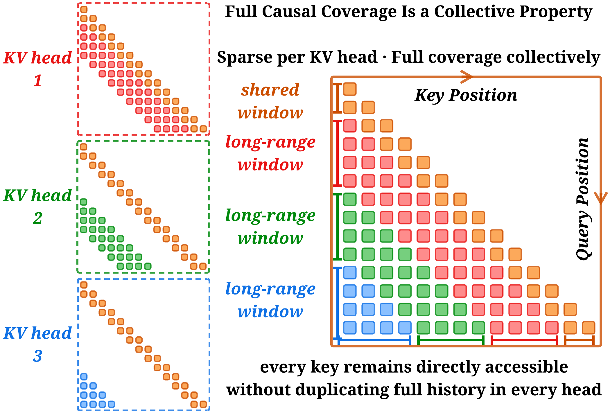

# CoWA：不同注意力头分担远处上下文，合起来保留覆盖

作者：Shi, Jingze、Peng, Zhangyang、Li, Xianduo、Qi, Yanlin、Lin, Xiaotian、Chen, Haoxian、Wang, Liangdong、Liu, Guang、Luo, Yuyu。arXiv:2609.32704 v1，提交2026-09-26。预印本。

新近创新 / 新近实用；热度待验证。已读核心原文，本站未训练复现。

长上下文中，每个注意力头都看相同的大窗口，会重复花费不少计算。CoWA让各KV头保留共同的起始与近邻区域，同时分配不同的远处窗口；所有头的窗口合起来覆盖因果历史。它不额外学习路由器，窗口规则在训练和推理中保持一致，跨并行设备时也按全局头编号分配。

互补性是核心消融：在8K合成联想回忆任务、相同预算下，只有1种远程窗口时成绩21.32，增加到8种互补窗口后89.73，完整注意力为89.97。这是256组键值、特定填充条件的回忆任务，说明覆盖设计有效，不等于所有长文推理都接近满分。

8张H100、TP8的128K微基准报告注意力前向7.4倍、反向8.6倍和解码约3倍加速。这里测的是算子；所谓约7.6倍内存改善也不是持久KV缓存缩小同样比例，历史KV仍保留在显存中。14B模型在32K训练条件下总FLOPs减少约28.5%，这比算子数字更接近训练整体口径。

为什么现在值得看：方法用固定、互补的连接模式换取计算减少，结构简单而可做清楚消融。代价是每个头单独看到的历史不完整，任务信息是否能由其他头补回仍需验证；RULER等指标并非全面超过完整注意力。研究者复现应同时记录算子、整模型速度和KV存储，避免把三者混为一谈。

CoWA作者方法原图，CC BY 4.0。颜色区分各头负责的远程窗口，共享的近邻部分相同；看所有头的并集，而不是误以为单个头仍能读取全部历史。（[作者原图](https://arxiv.org/abs/2609.32704v1)；[查看大图](../../../frontiers/2026/09/2026-09-30/images/cowa-method.png)。）

[原始论文](https://arxiv.org/abs/2609.32704v1) · [版本许可](http://creativecommons.org/licenses/by/4.0/)

原文为CC BY 4.0，保存未改动的v1 PDF并保留作者和许可。
[归档PDF](2609.32704v1.pdf)

[返回本期论文精选](../../../frontiers/2026/09/2026-09-30/03-论文精选.md)
