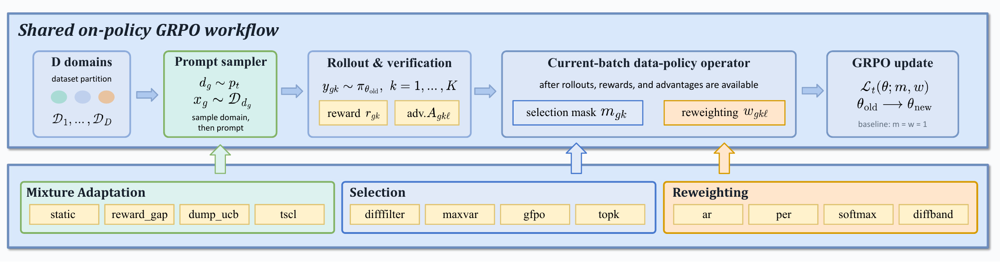

# DataFlex-RL：训练数据筛选的收益，怎样与随机波动分开

作者：Liang, Hao、Chen, Mingrui、Feng, Hengyi、Qiang, Meiyi、Zhang, Wentao。arXiv:2609.06107 v1，2026-09-05；本次按预印本阅读，未核实录用状态。

[原始论文](https://arxiv.org/abs/2609.06107v1) · [版本许可](http://creativecommons.org/licenses/by/4.0/)

可验证奖励强化学习中，挑选更难样本、提高某类题目的比重，是否一定优于均匀训练？DataFlex-RL 把策略放进统一评估框架，固定基础训练流程，再分别改变数据混合、生成后的样本筛选、以及损失中的权重。直觉上，它让“题目怎么来”“哪些轨迹留下”“每条轨迹算多重”不再混成一个变量。

主实验在 Qwen2.5-7B 基座上比较十三种配置，每种使用十二个匹配随机种子，共一百五十六次训练；更广的扫描总计五百九十一次运行。统一的 GRPO 基线本身提升约 7.76 个百分点，而八种筛选或加权方案相对均匀策略的差值，其 95% 置信区间均未排除零。这里的意思是证据不足以稳定分出胜负，不是证明这些方法在所有规模都无效。

评测集合也会改变排序：论文另用九次指令模型运行比较数学偏重与领域均衡测试，排序相关系数为 −0.33。只盯数学分数可能把其他能力变化漏掉。复现价值在于同预算、多种子、跨领域对照；若资源有限，可以先复核数据策略插入的位置与统计口径，而不是只重复作者最优一次运行。

从左到右看：绿色调配输入分布，蓝色筛选生成轨迹，黄色改变损失权重；它们操作的对象不同。（[作者原图](https://arxiv.org/abs/2609.06107v1)；[查看大图](../../../frontiers/2026/09/2026-09-15/images/paper-dataflex.png)。）

[打开本站归档 PDF](2609.06107v1.pdf)

[返回 2026-09-15 论文精选](../../../frontiers/2026/09/2026-09-15/03-论文精选.md)
