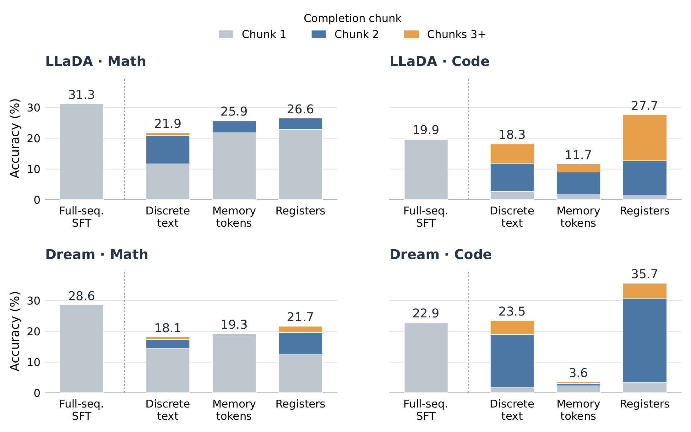

# Register Tokens：清空旧推理后，保留少量连续状态

作者：Ge, Albert、Singh, Chandan、Zhuang, Yufan、Liu, Xiaodong、Gao, Jianfeng、Sala, Frederic。arXiv:2609.16372 v1，2026-09-14；本期按预印本阅读，不宣称已录用。

[原始论文](https://arxiv.org/abs/2609.16372v1) · [版本许可](http://creativecommons.org/licenses/by/4.0/)

入选：新近创新。已读原文方法与实验；本站未复现。

扩散语言模型不断延长生成窗口会增加计算。论文把长推理分成固定大小的块：每块完成后，用一次无噪声前向把进展写入少量寄存器向量，清除已生成文本，再让下一块读取这些向量继续。原始问题仍保留，旧推理正文则不继续堆进窗口。

训练不能只添加几个空槽。作者用分块监督、特定提示遮挡与去噪设置，迫使模型学习经寄存器传递信息；对照包括直接携带最后几个离散 token 和另一种记忆 token 方案。主实验使用 LLaDA-8B、Dream-7B，数学块长 128、最多八块；代码块长 64、最多十六块，评分与数值精度也分别说明。

在同为分块训练的对照中，寄存器成绩更强。例如 Dream 的 MBPP pass@1 为 40.9%，离散文本携带为 21.4%。但全序列 SFT 在所有数学行仍更高：这说明有界状态会丢信息，不能把结果写成压缩历史后全面优于完整推理。

原图进一步把正确答案按完成块数拆开。代码的收益更多出现在后续块，数学则常较早完成。不同颜色仍以全部样本作分母，不是“进入第二块后的条件成功率”。历史耗时表另用固定完整预算、关闭提前停止的协议，因此本文没有把其中加速倍数推广到日常请求。适合复核状态槽、块长与任务之间的关系；本站未训练或运行模型。

作者实验原图：柱高是跨对应任务的平均成绩，颜色表示在哪一块完成。虚线左侧为全序列训练，右侧为分块训练；数学与代码的取舍不同，切勿只看寄存器最高的代码面板。（[作者原图](https://arxiv.org/abs/2609.16372v1)；[查看大图](../../../frontiers/2026/09/2026-09-17/images/paper-registers.png)。）

原始 PDF 按版本所列 http://creativecommons.org/licenses/by/4.0/ 保存，未改动内容。

[打开本站归档 PDF](2609.16372v1.pdf)

[返回本期论文精选](../../../frontiers/2026/09/2026-09-17/03-论文精选.md)
