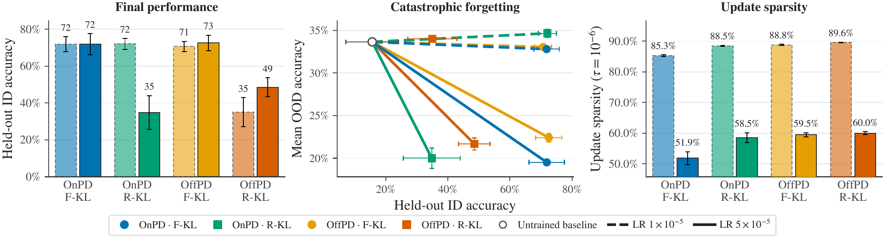

# 蒸馏动力学：先分清采样策略、损失和学习率

作者：Piskorz, Julianna、Berthon, Antonin、van der Schaar, Mihaela。arXiv:2609.35259 v1，提交日期 2026-09-28（原站日期）。预印本，未据模板推断录用。

为什么现在值得看：这篇新近创新研究把经常一起改变的三个因素拆开：训练答案由学生还是教师采样，匹配概率时使用哪个方向的 KL，以及学习率多大。作者实验，本站未复现；热度待验证。

“自己生成再学习”不一定是收益的唯一来源。研究以 Llama 3.1-8B 教师向 Llama 3.2-1B 学生蒸馏为主，在医学、科学和 Countdown 算术三个任务上独立改变这些因素，再以 Qwen2.5 做补充。主实验全参数训练 150 步、三随机种子，并比较七项分布外任务。这样才能看出，所谓 on-policy 优势是否其实来自损失或学习率。

结果并不支持一刀切。汇总最佳配置的平均准确率，学生采样与教师采样约为 72% 和 73%；前向 KL 在不同采样策略下较稳，反向 KL 对策略和学习率更敏感。低学习率的分布外性能下降不超过约 1.3 个百分点，高学习率条件下降约 11.2–14 个百分点。作者还用梯度分析解释前向 KL 的稳健性，但推导带有有界性等条件，不能直接升级为所有大模型的保证。

例外同样值得读：更难的四数 Countdown 上，学生采样有约 10–15 个百分点的泛化优势，不过接续 RLVR 后该优势未稳定保留。长推理补充实验也有更少种子等限制。最值得复用的是实验设计：先固定教师、任务、预算和学习率，再讨论采样策略；不要把两个完整训练配方的差异都归因于“是否 on-policy”。

Piskorz, Julianna 等，Figure 1，三任务最终准确率；阴影/误差来自三随机种子，不能跨任务直接比较难度。来源论文原图，CC BY 4.0；用于解释本段方法或实验。（[来源原图](https://arxiv.org/abs/2609.35259v1)；[查看原尺寸](../../../frontiers/2026/10/2026-10-04/images/paper-distillation.png)。）

[原始论文](https://arxiv.org/abs/2609.35259v1) · [版本许可](http://creativecommons.org/licenses/by/4.0/) · [归档 PDF](2609.35259v1.pdf)

英文摘要：On-policy learning has been argued to reduce catastrophic forgetting, produce sparser parameter updates, and improve generalisation. However, existing comparisons between supervised fine-tuning and reinforcement learning vary many factors simultaneously, making the contribution of rollout policy difficult to isolate. We study the effect of rollout policy in a controlled strong-to-weak distillation setting, by independently varying rollout policy, token-level KL direction, and learning rate across the Llama3 and Qwen2.5 model families and reasoning tasks spanning scientific, medical, and arithmetic domains. Our analysis reveals a nuanced picture of distillation dynamics in which rollout policy does not necessarily play a central role. Instead, token-level KL direction more clearly shapes task performance and output coverage, while learning rate governs forgetting and update sparsity. Analysis of KL gradients and experiments along a continuous student-teacher rollout-policy spectrum explain this pattern: forward KL is remarkably robust to rollout policy, with its performance stable and strong despite changes to the rollout policy, whereas reverse KL is substantially more sensitive and favours student-generated rollouts. On-policy data nevertheless improves generalisation to harder variants of the Countdown arithmetic task under both KL directions, although this advantage does not reliably persist after subsequent RLVR. Our broader conclusions remain robust to removing gradient clipping, using sampled KL estimators, and training on tasks requiring longer reasoning chains. Overall, our results challenge the view that on-policy rollouts are inherently preferable and show that their value depends critically on the objective, evaluation setting, and optimisation hyperparameters.

归档为未改动的 v1 PDF；再分发依据该版本 CC BY 4.0，作者署名与许可保留。

[返回本期论文精选](../../../frontiers/2026/10/2026-10-04/03-论文精选.md)
