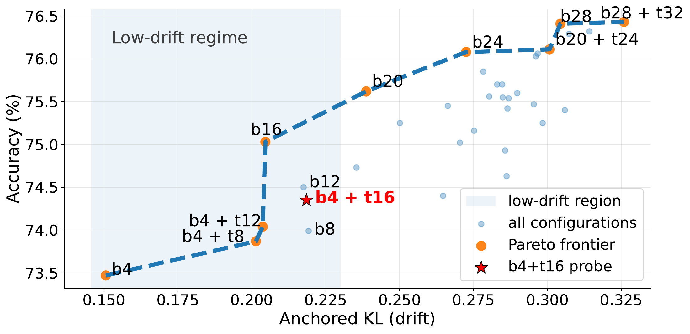

# DCO：相同的行为偏移预算，微调方向仍然重要

作者：Yuan, Fei、Gao, Changjiang、Tu, Yilei、Liu, Yifeng、Huang, Shujian、Qiao, Yu。arXiv:2609.13680 v1，2026-09-12；本期按预印本阅读，不宣称已录用。

[原始论文](https://arxiv.org/abs/2609.13680v1) · [版本许可](http://creativecommons.org/licenses/by/4.0/)

入选：新近创新。已读原文方法与实验；本站未复现。

微调想学会新任务，又希望保留原有能力。论文先固定参考模型，以参考输出到新模型输出的 KL 散度衡量行为偏移；在局部近似中，相同偏移预算下，更新方向决定能够改善多少任务损失。这里的“方向重要”有光滑性、局部邻域等条件，不能脱离这些条件理解成训练量从此不重要。

实作没有直接求巨大 Fisher 矩阵的逆，而是选择不同层来更新。LST 的一种设置先微调底部四层，再从该检查点微调顶部十六层，中部冻结。它只是寻找有效方向的结构化探针，不能宣称已经求到理论最优。

实验在 Qwen3-8B / 14B 上用问答对进行科学任务与多语言翻译适配，不提供推理轨迹监督，但推理阶段仍允许生成思考。作者比较全量、LoRA、KL 正则化和不同层组合；某些分层组合改善翻译并较好保留通用能力，部分连续层配置则更适合较大的偏移预算。

原图的纵轴来自另一组 MegaScience 留出集上的 teacher-forced 下一 token 准确率，并非自由生成任务成功率。图中红星配置也并非处处位于最优边界。因此复现时应同时量偏移、目标任务和通用能力，匹配训练预算与数据；不能只根据“少训练几层”断言必然优于 LoRA。本站未复现，结论限作者的模型、任务和局部分析。

作者分析原图：横轴是锚定 KL，纵轴是在真值前缀下的下一 token 准确率。b/t 表示底部/顶部层配置；红星不是所有条件的最优点，预算改变会改变更合适的取舍。（[作者原图](https://arxiv.org/abs/2609.13680v1)；[查看大图](../../../frontiers/2026/09/2026-09-17/images/paper-dco.png)。）

原始 PDF 按版本所列 http://creativecommons.org/licenses/by/4.0/ 保存，未改动内容。

[打开本站归档 PDF](2609.13680v1.pdf)

[返回本期论文精选](../../../frontiers/2026/09/2026-09-17/03-论文精选.md)
