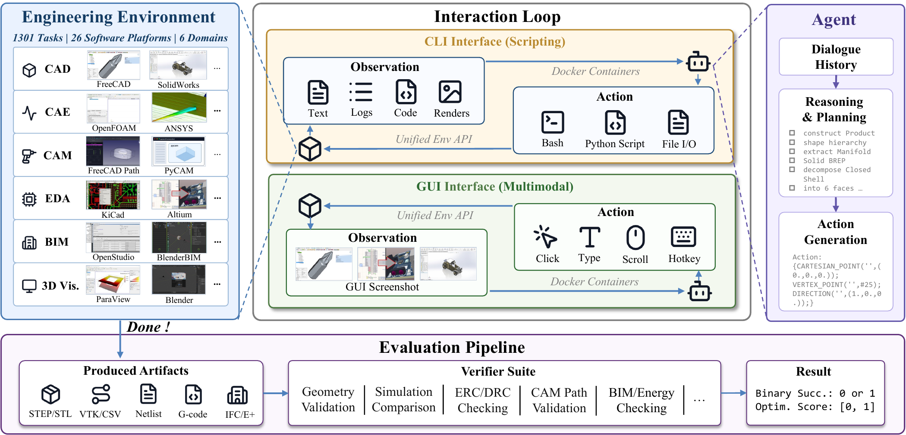

# EngiWorld：验收工程产物，而不是只看Agent说完成了

作者：Gao, Hongcheng、Qu, Hailong、Lei, Yu、Sun, Henghui、Li, Haoyang、Wei, Yipeng、Xue, Naihao、Yu, Xiaohan、Tao, Zhuo、Zang, Yihe、Wang, Yajiao、Tang, Jingyi、Li, Yi、Zhou, Jingjing、Luo, Jie、Zeng, Bohan、Shen, Chengyu、Jiang, Hao、Chen, Chong、Qu, Bowen、Huang, Olive、Wang, Zeqiang。arXiv:2609.37686 v1，提交2026-09-29。arXiv研究稿；会议页眉未独立核实。

新近创新 / 新近实用；热度待验证。已读核心原文，本站未训练复现。

EngiWorld收集1301个任务，覆盖CAD、仿真、制造、建筑、电子设计和3D可视化等六类领域、26种软件。关键是读取实际产物，如STEP、网表和G-code，检查几何、物理及规则要求；量化设计先过可行性门槛，再按质量计分。

为控制成本，七模型主实验使用同一份300题分层子集，含152个CLI任务与148个GUI任务，并非全量1301题。最高总体EngiScore为44.3；所有模型在128题上均得零分。跨软件任务共168次尝试只成功6次，说明会操作单个应用与能维持跨应用约束之间仍有差距。

为什么现在值得看：专业Agent需要能够重新计算、检查的交付物，截图相似或口头完成不足以验收。EngiScore混合二元成功与连续质量，不能简单称44.3%全任务成功率。商业软件许可、虚拟机、不同任务轮数和少量开放题也限制复现及排名解释；稿件写有ICLR 2027页眉，本期未取得独立录用记录，按arXiv研究稿阅读。

作者Figure 2原图。上半部是GUI/CLI与软件交互，下半部才是文件和领域验证器。真正决定分数的是产物验收；主实验只用300题子集。（[作者原图](https://arxiv.org/abs/2609.37686v1)；[查看大图](../../../frontiers/2026/10/2026-10-01/images/engiworld-framework.png)。）

[原始论文](https://arxiv.org/abs/2609.37686v1) · [版本许可](http://arxiv.org/licenses/nonexclusive-distrib/1.0/)

arXiv非独占分发许可不直接授权本站再分发全文；本期保存阅读卡和原站链接，只引用一幅有署名的原图作方法评论。
[返回本期论文精选](../../../frontiers/2026/10/2026-10-01/03-论文精选.md)
