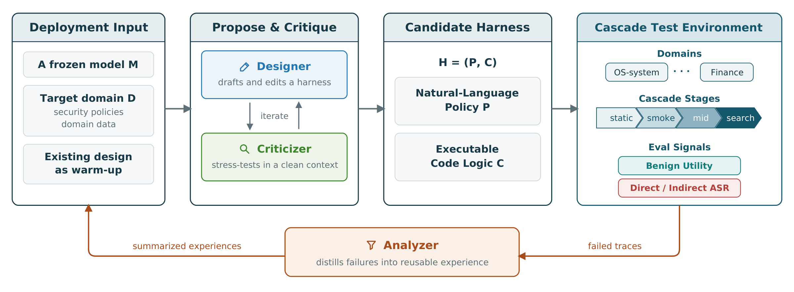

# EvoSafeHarness：针对具体模型和任务环境搜索防护流程

原题：EvoSafeHarness: Evolving Model- and Domain-Specific Harnesses for Securing Agents

作者：Nanxi Li、Yingzi Ma、Yulong Cao、Edward Suh、Bo Li、Dawn Song、Chaowei Xiao

[arXiv:2609.05903v1](https://arxiv.org/abs/2609.05903v1) · 2026-09-05T05:56:41Z 提交 · v1 预印本。本站阅读记录：2026-09-12。

## 研究问题与方法

相同防护规则放到不同模型和任务环境中，效果可能相差很大。EvoSafeHarness 冻结被保护模型，针对特定领域搜索外围策略和执行代码：设计者提出候选，新的上下文中的批评者检查缺陷，通过后再进入从便宜到昂贵的级联测试，失败轨迹用于下一轮改进。

方法把正常任务完成率、直接有害请求和间接提示注入分开评价。这样可以阻止“全部拒绝”凭低攻击成功率获得高分，也能看出失败发生在输入判断、工具调用还是多步状态管理。搜索结果依赖模型、领域和信任边界，并不是一个通用提示词。

图｜来源原图。Nanxi Li 等，原文 Figure 3。中间 H=(P,C) 表示自然语言策略与可执行代码一起搜索。右侧同时评估正常任务效用和直接、间接攻击成功率；只把所有任务拒绝掉，不能算高质量防护。底部失败轨迹回流给下一轮设计，目标模型本身保持冻结。 原图按 CC BY 4.0 引用。 [原始来源](https://arxiv.org/abs/2609.05903)。点击图片查看原尺寸。

## 实验、结果与边界

在 DecodingTrust-Agent 的五模型、三领域共 15 个组合中，平均攻击成功率从 45.6% 降到 10.0%，正常任务效用下降 3.3 个百分点。AgentDojo 的观测结果为 82.8% 效用、0% 攻击成功率；有限测试中的零次成功不等于安全保证。自适应攻击在更高预算下仍能恢复部分突破。

最有复现价值的是把防护修改与失败轨迹对应起来，同时保留未参与搜索的攻击和正常任务。搜索器与评测本身消耗模型调用，模型更新后也需要重新检查。论文于 9 月 5 日提交，本期为近期补充；当前是预印本，本站未运行攻击或防护搜索。

## 复现时优先检查

- 效用与攻击成功率是否分开记录？
- 测试攻击是否参与过防护搜索？
- 更换模型、领域或攻击预算后，结论能否保持？

## 原文与归档

[站内固定版本 PDF](2609.05903v1.pdf) · [原始 PDF](https://arxiv.org/pdf/2609.05903v1)。arXiv 页面标注 [CC BY 4.0](https://creativecommons.org/licenses/by/4.0/)，本地归档保留完整原文、作者署名与原始许可，未修改 PDF。

[返回 9 月 12 日论文精选](../../../frontiers/2026/09/2026-09-12/03-论文精选.md)
