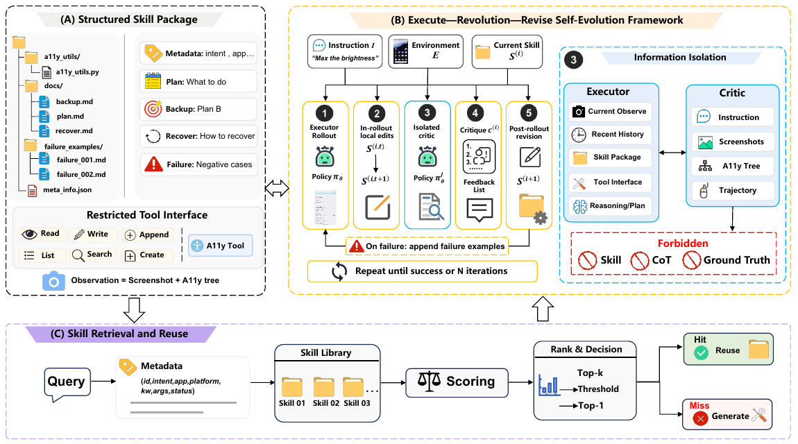

# EvoSkill-GUI：把失败经验改进到可复用技能文件里

作者：Chen, Bofan、Zhang, Boxuan、Tang, Fei、Lu, Zhengxi、Du, Yong、Chen, Tongbo、Lu, Weiming、Xiao, Jun、Zhuang, Yueting、Shen, Yongliang。arXiv:2609.17653 v1，2026-09-15；按预印本阅读，不宣称录用。

[原始论文](https://arxiv.org/abs/2609.17653v1) · [版本许可](http://creativecommons.org/licenses/by/4.0/)

入选：新近创新，热度待验证。已读原文核心方法与结果；本站未复现训练或大型评测。

GUI会弹窗、延迟加载或移动控件，提前写好的固定步骤容易失效。EvoSkill-GUI把技能拆成元数据、计划、备用定位、恢复规则、无障碍辅助和失败案例等文件，执行中可局部修改；失败后再反思，修订具体文件，供相关任务复用。改变的是外部技能包，不是模型权重。

执行者与评论者使用同一基础模型，但评论者在隔离会话中只看指令、截图、无障碍树和动作轨迹，不看技能正文、执行者思考或标准答案。这样可减少沿着原来错误计划继续解释的倾向。编辑工具也被限制在技能结构内，修订记录更容易追踪，不过限制接口不是正确性证明。

实验覆盖MobileWorld、AndroidWorld及OSWorld，最多50步交互，失败后最多两轮修订。MobileWorld上Qwen3.6-Plus成功率由53.3%到69.5%，是16.2个百分点；OSWorld上Qwen3-VL-8B-Instruct由23.8%到34.3%。个别应用分项仍下降，不能只取每个基准的最大增益。

作者没有提供能否决有害技能修改的形式验证器，基础模型若误读屏幕或误判失败原因，修订反而可能破坏已有技能。AndroidWorld的高复用率主要来自同类任务参数变化，不等于陌生应用通用迁移。每次失败还增加反思与编辑调用，节约训练不等于没有推理成本。

[作者代码](https://github.com/ZJU-REAL/EvoSkill-GUI)提供研究入口。本期已阅读完整PDF的方法、结果与限制；下图取自论文图2，保留完整论文入口。本站未运行桌面或手机基准。

作者图2的完整图示区域，来自PDF第4页，裁去周围正文。先看左侧技能拆分，再看中间执行—反思—修订，最后看下方检索复用；右侧标明评论者看不到哪些信息。（[作者原图](https://arxiv.org/abs/2609.17653v1)；[查看大图](../../../frontiers/2026/09/2026-09-20/images/evoskill-method.png)。）

原始PDF按版本所列 http://creativecommons.org/licenses/by/4.0/ 保存，内容未改动。

[打开本站归档PDF](2609.17653v1.pdf)

[返回本期论文精选](../../../frontiers/2026/09/2026-09-20/03-论文精选.md)
