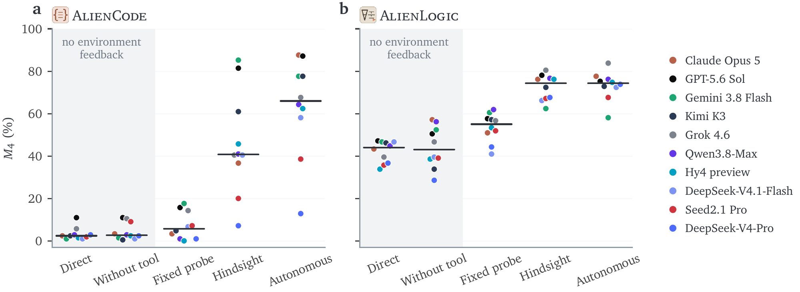

# ExplorationBench：会做题，也要会发现规则

作者：Zhang, Ming、Xiang, Zhenghao、Gao, Peizhong、Shen, Yujiong、Wang, Yuhui、Yue, Zhonghan、Dou, Shihan、Yin, Zhangyue、Ye, Junjie、Liu, Shichun、Zheng, Weihuang、Chen, Jiahao、Chen, Jiayi、Liu, Hongzhang、Shao, Jiaqi、Gui, Tao、Zhang, Qi、Huang, Xuanjing、Zheng, Suncong、Pan, Maxm。arXiv:2609.30199 v1，首发2026-09-24。预印本。

新近创新 / 新近实用；热度待验证。已读核心原文，本站未复现。

ExplorationBench先给Agent一份不完全可靠的说明书，再让它通过工具实验发现真实规则。AlienCode含31条隐藏规则和70道任务，AlienLogic含24条隐藏规则和70道任务；工具分别提供确定性的解释器或证明检查器。每个Agent获得相同的10个示例，在四轮探索后接受测试，没有微调或额外外部记忆。

评测在指定里程碑分叉对话，关闭探索工具，再测试答题。论文运行10个系统、各三条探索轨迹，主指标Best@3选取整条轨迹终点最好的一次，不是同一道题采样三次就算对，也不代表用户日常可以稳定得到的结果。

AlienCode里，Claude Opus 5最好轨迹87.6、三次平均72.5、最差49；Kimi对应77.6、37.5和4.8。单看最好一次会掩盖很大的不稳定性。控制实验比较不探索、固定探针、事后挑出的探针和自主探索，但自主探索的Best@3与部分控制的一条轨迹有采样预算差别，不能当作完全公平的排行榜。

现在值得复用的是“提出实验→得到反馈→修订规则”的评测拆分。更多探索并不总带来更好成绩，也会停滞或退步。这里只是合成、确定性的规则环境，三条轨迹不足以刻画所有随机性；不能据此推断系统已经具备真实科研能力。读者应同时看均值、最差值、实验预算和发现了哪些规则。

作者的控制条件比较原图。每个点对应模型，粗线汇总条件表现；自主探索与部分控制的轨迹选择预算不同。它帮助定位“工具、信息还是探索策略”带来的差别，不能忽略这些条件直接排名。CC BY 4.0。（[作者原图](https://arxiv.org/abs/2609.30199v1)；[查看大图](../../../frontiers/2026/09/2026-09-26/images/exploration-conditions.png)。）

[原始论文](https://arxiv.org/abs/2609.30199v1) · [版本许可](http://creativecommons.org/licenses/by/4.0/)

采用CC BY 4.0，归档未改动的原版PDF，保留作者、版本和许可。
[归档PDF](2609.30199v1.pdf)

[返回本期论文精选](../../../frontiers/2026/09/2026-09-26/03-论文精选.md)
