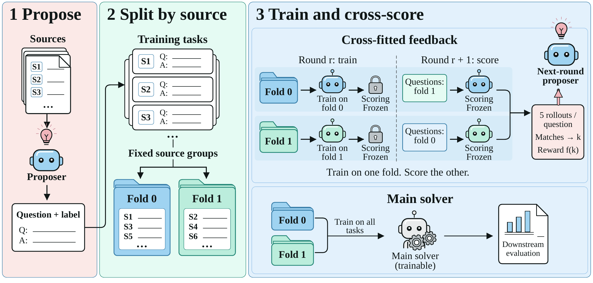

# False Frontiers：出题者和解题者一起答错，奖励仍可能上涨

作者：Chen, Meijia、Li, Hao、Lu, Zheng、Lin, Hongshan、Tian, Junbai、Liu, Yichen、Tian, Zijun、Zou, Yufan、Sun, Shuhan、Chen, Hanxin、Zhang, Zeyu、Du, Weizhi、Li, Yueting、Shi, Tianyu、Khamis, Alaa。arXiv:2609.39102 v1，提交2026-09-30。预印本。

新近创新 / 新近实用；热度待验证。已读核心原文，本站未训练复现。

模型自己出题、自己作答，再按双方是否一致发奖励，看上去能不断生成训练题。但如果出题者给了错误答案，解题者又从同一批伪标签学会了这个错误，一致性便成了错误的正反馈。论文称其为 co-cheating，指的是系统性共享错误，不需要假定模型有意作弊。

CrossFit 的关键是**按原始来源文档分组**，不是随机拆问题：辅助解题器 A 只用 A 组来源训练，去给 B 组问题评分；另一个辅助解题器反过来做。主解题器仍可用全部获准题目训练。改变的是用于奖励出题者的反馈来源，原有奖励函数与主解题器学习规则保留。

三轮实验中，Qwen3.5-4B/9B 的错误一致占比由 6.1%/8.8% 降至 3.0%/3.7%；只做多采样标签验证的 MSV 为 5.7%/7.2%。在固定 1325 题、七个搜索问答基准、相同工具预算与单条贪心轨迹条件下，七项平均成绩由 40.0/42.8 提高到 48.8/51.2。论文另有固定题库回放实验，0.4%/0.1% 属于该诊断条件，不能拿来替代完整自训练结果。

为什么现在值得看：新论文把“奖励增长是不是能力增长”落实为来源隔离实验，对合成数据流水线很有参考价值。真值审计仍借助带来源的外部模型判断，不是全面人工标注；来源分组不能消除共享预训练知识中的错误，还增加辅助模型训练成本。复现宜先记录每道题的来源及反馈模型训练来源，再讨论换更强裁判。

论文作者的 CrossFit 算法原图，CC BY 4.0。先看中间按来源分组，再看右上交叉评分；右下主解题器仍使用全部训练题。评分模型与主模型的职责不能混为一谈。（[作者原图](https://arxiv.org/abs/2609.39102v1)；[查看大图](../../../frontiers/2026/10/2026-10-02/images/crossfit.png)。）

[原始论文](https://arxiv.org/abs/2609.39102v1) · [版本许可](http://creativecommons.org/licenses/by/4.0/)

原文为CC BY 4.0，保存未改动的v1 PDF并保留作者和许可。
[归档PDF](2609.39102v1.pdf)

[返回本期论文精选](../../../frontiers/2026/10/2026-10-02/03-论文精选.md)
