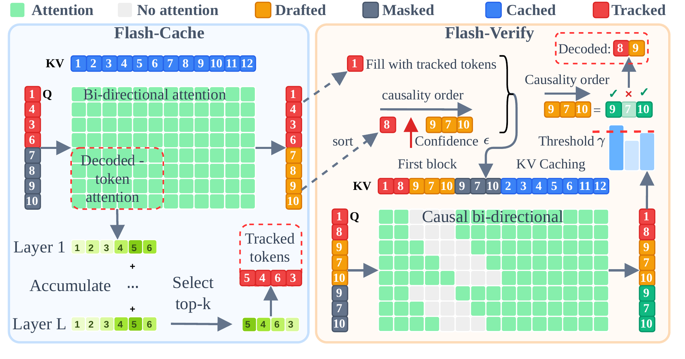

# Flash-dLLM：缓存和并行解码一起设计

作者：Nguyen-Tri, Quan、Ranjan, Mukul、Shen, Zhiqiang。arXiv:2609.26796 v1，2026-09-22。预印本。

新近创新 / 新近实用；热度待验证。已读核心原文，本站未复现。

扩散语言模型会反复填入被遮盖的 token。它不像自回归模型那样能简单复用全部过去状态：缓存会变旧，多个位置同时决定也会忽略彼此依赖。Flash-dLLM 同时改缓存和解码，不需要另训一个草稿模型。

Flash-Cache 将投影、旋转位置编码和缓存写入融合，减少中间张量在显存中的来回搬运；只更新当前窗口与一部分重要已解码位置。Flash-Verify 让低置信度候选以“已填草稿”和“仍被遮盖”两种视图参与验证，约束注意力可见范围，一致且置信度达标才接受，遇到不一致就停止继续接受后面的候选。

主评测使用 LLaDA-1.5、单张 A100 80GB、Triton 2.0，并在相同环境重跑基线。GSM8K 的 512-token 设置中，Elastic-Cache 为 41.7 token/s、82.79%；组合方法为 210.6 token/s、83.02%，约 5.1 倍吞吐。这里不是任意模型的平均加速，也不是把总业务响应时间缩短五倍。

代码生成中最快配置并非总是最准：256-token HumanEval 距离该行最高准确率约差 3.66 个百分点。缓存近似、阈值和窗口形成速度质量取舍；长文聊天与连续空间扩散仍缺验证。新近实用之处是公开了可检查的内核与解码流程，适合有 NVIDIA GPU、愿意核对吞吐定义的推理研究者。

作者 Flash-dLLM 总览（Figure 2）。左侧是缓存及选择更新，右侧是草稿与遮盖视图验证；并行验证不代表可以忽略 token 依赖。CC BY 4.0，原关系与标签未修改。（[作者原图](https://arxiv.org/abs/2609.26796v1)；[查看大图](../../../frontiers/2026/09/2026-09-24/images/flash-dllm.png)。）

[原始论文](https://arxiv.org/abs/2609.26796v1) · [版本许可](http://creativecommons.org/licenses/by/4.0/)

版本采用 CC BY 4.0，保留作者与版本归属。
[归档 PDF](2609.26796v1.pdf)

[返回本期论文精选](../../../frontiers/2026/09/2026-09-24/03-论文精选.md)
