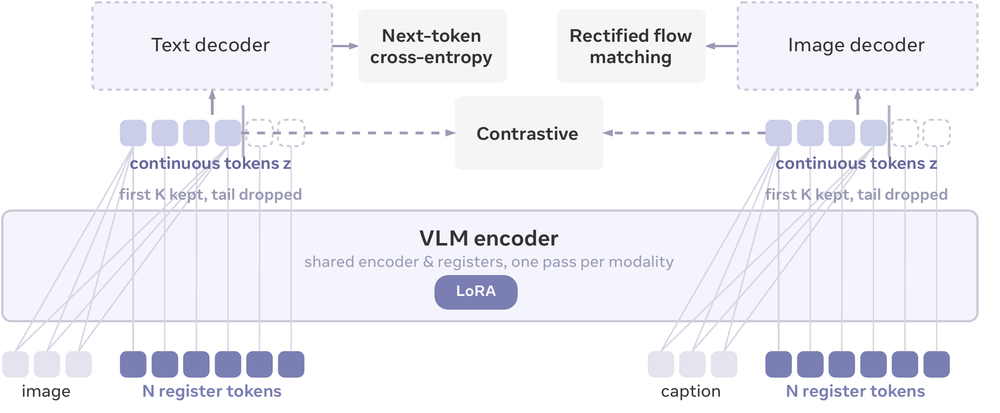

# FLAT：让一段可截短的表示同时服务检索与生成

作者：Sun, Guangyu、Mishra, Shlok Kumar、Bao, Wentao、Yang, Robert Zhenheng、Wang, Xiao、Wang, Xiyuan、Ma, Yujunrong、Yuan, Chen、Fan, Max Xiangjun、Xiao, Jun、Cheng, Jianpeng。arXiv:2609.16591 v1，2026-09-15；本期按预印本阅读，不宣称已录用。

[原始论文](https://arxiv.org/abs/2609.16591v1) · [版本许可](http://creativecommons.org/licenses/by/4.0/)

入选：新近创新。已读原文方法与实验；本站未复现。

检索通常需要紧凑表示，生成却需要保留更多细节。FLAT 用共享视觉语言编码器，将图像和文字分别变成最多 256 个、每个 64 维的连续 token；训练时随机只保留前 1、4、16、64 或 256 个。前面的表示因此需要先容纳更通用的信息，后面的表示补充细节。

训练同时包含图文对比、图像到文本预测和文本到图像的流匹配目标。骨干采用 Qwen3.5-2B，图像解码器用 SANA-1.6B；任务阶段还各自微调，不是同一个未经适配的检查点在所有任务直接达到最佳成绩。

COCO 检索的一个对照中，图到文 R@1 从 256 个 token 的 63.54% 变为单 token 的 63.00%；存储宽度可由 16384 维缩到 64 维。这个 256 倍是表示大小之比，编码过程并未因此保证快 256 倍。细节生成更依赖长前缀，单 token 的颜色绑定表现明显不足。

经过作者指定的图像生成微调后，GenEval 为 0.83；消融表的短训练结果属于另一阶段，不能混作同一成绩。研究价值在同一表示设计能按任务选择粒度，局限是训练目标耦合、任务适配成本及细粒度信息丢失。复核时可先比较前缀长度与检索质量，再看生成细节，不只挑压缩比例。

作者方法原图：图像和文字各自经过共享编码器与寄存器，只留下前 K 个连续 token；上方三个训练目标分别约束文本、图像与跨模态对齐。截短的是输出表示，不等于跳过全部编码计算。（[作者原图](https://arxiv.org/abs/2609.16591v1)；[查看大图](../../../frontiers/2026/09/2026-09-17/images/paper-flat.png)。）

原始 PDF 按版本所列 http://creativecommons.org/licenses/by/4.0/ 保存，未改动内容。

[打开本站归档 PDF](2609.16591v1.pdf)

[返回本期论文精选](../../../frontiers/2026/09/2026-09-17/03-论文精选.md)
