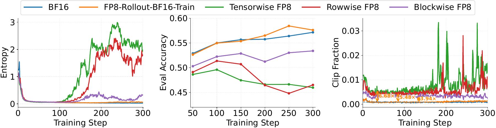

# 全流程 FP8 强化学习：量化改变了哪些 token 还能被惩罚

作者：Chen, Fanchao、Jiang, Ziheng、Wei, Ziyun、Zhong, Zheng、Li, Du、Zhang, Chi、Lin, Haibin、Venkataraman, Shivaram。arXiv:2609.22870 v1，2026-09-19。预印本，未宣称录用。

入选：新近创新；热度待验证。已读核心原文，本站未复现。

把 rollout 和训练都切到 FP8，不只是少存几位小数。本文发现量化扰动会改变新旧策略的概率比；对于负优势 token，概率比一旦被推过下裁剪边界，它本该受到的惩罚可能被截断。乱码等低质量输出因而可能持续累积，伴随异常熵增长。

Calibrated Clipping 用同批次的 BF16 参考前向校准：先让 FP8 下负优势 token 的裁剪比例接近 BF16，再调整上边界，平衡正负更新贡献。参考前向有代价，所以作者每 20 个训练步重校准一次，并平滑更新边界；这不是完全摆脱高精度计算的方案。

实验基于 VeRL、vLLM、TorchAO 和 FlashRL 补丁。Qwen3-8B 的 GRPO 数学任务中，blockwise FP8 的八项平均分由 54.1 到 58.6，BF16 基线为 57.6；但 tensorwise、rowwise 校准后仍低于 BF16。Qwen3-14B 的 DAPO 实验也恢复了不少性能，却没有全部追平 BF16。因此“稳定训练”不能改写成所有粒度都无损。

吞吐图是离线训练阶段测试，排除了周期性 BF16 参考前向；最高约 1.5 倍不能当成完整 RL 作业的端到端收益。为什么现在值得看：它定位了量化和裁剪规则之间的具体失配，给出可验证干预，而不只说 FP8 更快。复现还要关注硬件、响应长度、检查点选取与多随机种子稳定性。

作者案例分析图。把异常熵、训练表现与不同精度对照一起看，理解为什么“还能运行”不代表训练稳定。限本条方法评论引用，保持原图坐标、曲线和图例。（[作者原图](https://arxiv.org/abs/2609.22870v1)；[查看大图](../../../frontiers/2026/09/2026-09-23/images/paper-fp8.png)。）

[原始论文](https://arxiv.org/abs/2609.22870v1) · [版本许可](http://arxiv.org/licenses/nonexclusive-distrib/1.0/)

此版本采用 arXiv 非独占分发许可，不能据此推断本站获准再分发全文；本站只保存阅读卡，PDF 请到原站阅读。方法图在本页针对性技术评论中作有限引用，未改动数据或关系，不表示可任意再分发。
[返回本期论文精选](../../../frontiers/2026/09/2026-09-23/03-论文精选.md)
