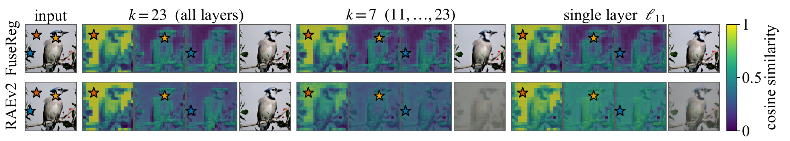

# FuseReg：重建看浅层，生成看深层，训练时让解码器少依赖固定组合

作者：Du, Hongyang、Xie, Yunfei、Ye, Junjie、Yang, Jiawei、Cong, Xiaoyan、Zhang, Haodong、Huang, Yongchao、Wu, Haiyu、Li, Zongxia、Gui, Shihang、Liu, Dawei、Li, Runhao、Ni, Jingcheng、Wei, Chen、Balestriero, Randall、Wang, Yue。arXiv:2609.31620 v1，提交2026-09-25。预印本。

新近创新 / 新近实用；热度待验证。已读核心原文，本站未训练复现。

冻结的视觉编码器有很多层：浅层细节有利于重建，深层语义往往更利于生成。FuseReg不是寻找一组永远最好的融合权重，而是在训练解码器时随机使用不同层子集，使完整、稀疏乃至单层输入都能被解码。直觉是避免解码器把某个固定组合当作必需条件。

实验采用DINOv3-L表征与ImageNet 256×256。固定DiT-XL生成器、只改解码器时，深层k=23的无引导gFID从3.01降到2.21；但是带引导条件下，对照1.25与所列最佳设置1.25相同。不能将无引导的约27%相对变化搬到所有设置。

分布变化实验更能解释方法价值：在k=7生成潜变量上，某对照的gFID为27.73，正则化解码器为1.92，说明它不那么依赖固定输入分布。另一组联合训练使用较小DiT-Base，13.96到9.93；这与只换解码器的实验不是一组。重建指标也有取舍，PSNR改善同时rFID可能变差。

为什么现在值得看：它把表征选层和生成解码之间的冲突变成可做消融的训练策略。复用时应同时测重建、原分布生成和潜变量变化后的输出，而不是挑一个最有利数字。结论主要来自一个视觉骨干与ImageNet，跨编码器、视频或其他数据分布仍需验证。

FuseReg作者的层表征与重建对照原图，CC BY 4.0。先比较不同层输入引起的重建变化，再看融合后的稳定性；示例图解释层信息差异，不代替整体生成评测。（[作者原图](https://arxiv.org/abs/2609.31620v1)；[查看大图](../../../frontiers/2026/09/2026-09-29/images/fusereg-reconstruction.png)。）

[原始论文](https://arxiv.org/abs/2609.31620v1) · [版本许可](http://creativecommons.org/licenses/by/4.0/)

原文为CC BY 4.0，保存未改动的v1 PDF并保留作者和许可。
[归档PDF](2609.31620v1.pdf)

[返回本期论文精选](../../../frontiers/2026/09/2026-09-29/03-论文精选.md)
