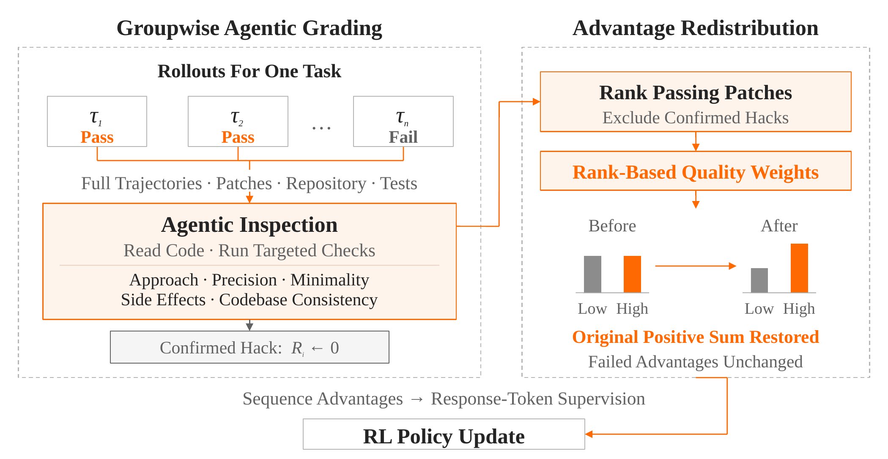

# GAGAR：都通过测试的代码，仍可以分出更好的写法

作者：Dong, Jinhao、Zhao, Liang、Yue, Zihao、Ma, Wenhan、Zhang, Linghao、Li, Lei、Li, Shicheng、Song, Yifan、Ye, Bowen、Luo, Fuli。arXiv:2609.32577 v1，提交2026-09-26。预印本。

新近创新 / 新近实用；热度待验证。已读核心原文，本站未训练复现。

代码Agent强化学习常用“测试通过/失败”奖励。问题是，两条都通过的轨迹可能差异很大：一条修改精确，另一条留下冗余改动或副作用。GAGAR让能查看补丁、仓库、测试和轨迹的评分Agent，对通过者作相对质量评价，再调整它们获得的正优势。

它没有简单给总奖励加一个可任意放大的文风分。对于同时有成功和失败的采样组，先计算奖励减去组平均的优势；失败项保持不变，通过项乘以质量因子，再统一缩放，恢复原来的正优势总量。只有一个成功项、或者质量相同，都会退回原分配。确认存在奖励投机的样本先改判，再重新计算组内优势。

匹配的Flash代码训练比较使用每题16条轨迹、batch 128等条件。训练到第28步，基线在此前上升后回落至50.2，GAGAR为62.2；此结果是论文的avg@3评测，不是某个上线产品的通用成功率。平均工具轮数和轨迹token也较少，但评分器本身要额外耗时，不能只报Agent执行一侧的节省。

为什么现在值得看：它给二值验收之外的质量差异一个受约束的学习入口，并提供匹配训练曲线。工业混合训练中MiMo-Flash/Pro的更高分来自更多条件，不能全部归因于这一个技巧。质量评分仍依赖模型判断，错误评分和额外训练开销需要实测。本站的[小实验](../../../frontiers/2026/09/2026-09-30/05-技术实践.md)只检查守恒、退化情况与错误因子处理。

GAGAR作者方法原图，限一幅用于方法评论。先区分失败与通过，再看质量因子只重新分配正优势；最终缩放保持正优势总量，不能把图理解为无约束增加奖励。（[作者原图](https://arxiv.org/abs/2609.32577v1)；[查看大图](../../../frontiers/2026/09/2026-09-30/images/gagar-method.png)。）

[原始论文](https://arxiv.org/abs/2609.32577v1) · [版本许可](http://arxiv.org/licenses/nonexclusive-distrib/1.0/)

arXiv非独占分发许可不直接授权本站再分发全文；本期保存阅读卡和原站链接，只引用一幅有署名的原图作方法评论。
[返回本期论文精选](../../../frontiers/2026/09/2026-09-30/03-论文精选.md)
