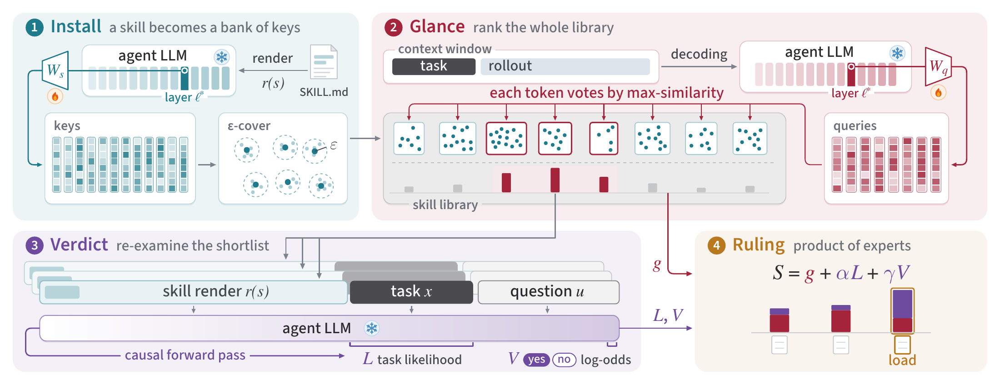

# Gavel：从冻结模型的隐藏状态中选择技能

作者：Chen, Ruishuo、Wang, Xun、Chen, Yu、Li, Zhuoran、Huang, Longbo。arXiv:2609.15982 v1，2026-09-14；本期按预印本阅读，不宣称已录用。

[原始论文](https://arxiv.org/abs/2609.15982v1) · [版本许可](http://creativecommons.org/licenses/by/4.0/)

入选：新近创新。已读原文方法与实验；本站未复现。

技能库越来越大，把所有描述放进上下文会挤占任务信息。Gavel 冻结 Agent 主模型，从其中间层读取任务与技能的隐藏状态，用一次训练的查询/键投影做细粒度匹配。新技能安装时只需编码，不必为每次新增文档重新训练路由器。

流程分两段：先用 token 级相似度从全库选候选，再让原模型同时查看任务与候选技能，通过任务似然和相关性判断复核。压缩技能向量库可减少存储，三类信号联合决定最终载入对象；因此“冻结模型”不代表整个方法完全没有训练或额外前向计算。

主实验在 Qwen3-32B 上训练约 790 万投影参数，并在多个技能基准及模拟执行轨迹上比较。Skill-Use 的 177 个可执行任务中，正确技能触发率为 90.9%，强检索重排对照为 89.7%。这个指标只回答技能是否选对，不能写成 90.9% 的端到端任务都完成。

静态基准还有重要评分条件：标注并不穷尽所有合适技能，作者用模型裁判裁定替代技能是否可接受；200 对人工抽查的记分一致约 86%，并不完全一致。原始标注分数另有报告，仍需一起看。方法要求读取隐藏状态，普通托管聊天 API 无法直接照搬，云服务端托管路由只是讨论中的部署方案。适合研究技能选择与 Agent 内部表示的关系，本站未独立复现。

作者方法原图：安装时缓存技能向量，运行中先做 glance 筛选，再用 verdict 复核。只有选中的技能进入主任务；右侧复核仍需要模型计算，不是零开销检索。（[作者原图](https://arxiv.org/abs/2609.15982v1)；[查看大图](../../../frontiers/2026/09/2026-09-17/images/paper-gavel.png)。）

原始 PDF 按版本所列 http://creativecommons.org/licenses/by/4.0/ 保存，未改动内容。

[打开本站归档 PDF](2609.15982v1.pdf)

[返回本期论文精选](../../../frontiers/2026/09/2026-09-17/03-论文精选.md)
