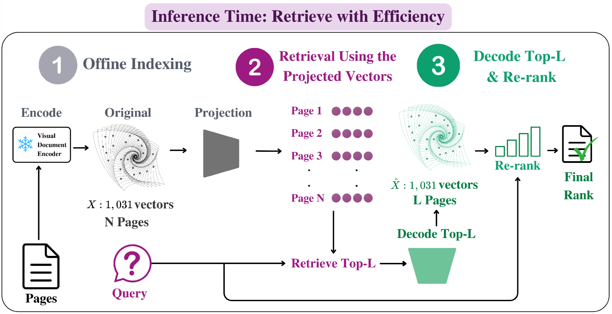

# GLIE：每页少存向量，只给候选页重建细节

原题：Generative Late-Interaction Embeddings For Visual Document Retrieval

作者：Mohamed Eltahir、Talal Aloushan、Rose Khairoalsendi、Jana Shata、Mohammed Alhassan、Leen Alrehaili、Tanveer Hussain、Naeemullah Khan

[arXiv:2609.11808v1](https://arxiv.org/abs/2609.11808v1) · 2026-09-10T16:58:39Z 提交 · v1 预印本。本站阅读记录：2026-09-12。

## 研究问题与方法

视觉文档检索常为每页保留上千个局部向量，让问题中的不同词能分别匹配表格、图注和正文。质量较好，索引却很大。GLIE 把每页压成少数锚点：先用这些锚点检索全库，只对入围页面解码出较密的向量集合，再做精细排序。

方法从冻结的 ColPali 等编码器出发。普通聚类中心会落在单位球内部，影响点积匹配；先做球面归一化，再用小网络调整锚点与重建向量。训练不仅拟合分数和排序，还约束集合形状，避免生成的局部证据把不相关页面错误抬高。

图｜来源原图。Mohamed Eltahir 等，原文 Figure 3。紫色阶段让所有页面只用少量锚点参与初筛，绿色阶段只为 Top-L 候选恢复较多向量。重排使用的是生成的向量，而不是重新取回原始 1,031 个向量。因此，初筛漏页与解码失真是两个不同瓶颈。 [原始来源](https://arxiv.org/abs/2609.11808)。点击图片查看原尺寸。

## 实验、结果与边界

主要实验在 ViDoRe v1、v2 上比较相同存储预算的压缩方法，并在 ColQwen2 上补充检查。ColPali 每页原有 1,031 个 128 维向量；压到四个向量、约 1 KB 时，报告保留约 79% 的未压缩检索质量。它是相对于基线 nDCG@5 的比例，不是绝对准确率 79%。

同一候选集若用理想恢复向量，成绩仍明显高于当前解码器，说明重建质量有提升空间。扩大候选数量并不必然解决这部分误差。复现可先比较原始聚类与球面归一化，再训练小解码器，同时记录索引体积、召回、重排质量和耗时。当前为预印本，本站未复现训练。

## 复现时优先检查

- 固定字节预算后，还节省了多少索引空间？
- 质量下降来自候选页漏召回，还是重建向量失真？
- 重排增加的时间是否符合实际查询预算？

## 原文与归档

[原始 PDF](https://arxiv.org/pdf/2609.11808v1) · [HTML 原文](https://arxiv.org/html/2609.11808v1)。arXiv 页面标注[非独占分发许可](https://arxiv.org/licenses/nonexclusive-distrib/1.0/)，它并未直接授予本站全文再分发许可，因此保存原创阅读卡与必要的图形引用，不托管整篇 PDF。

[返回 9 月 12 日论文精选](../../../frontiers/2026/09/2026-09-12/03-论文精选.md)
