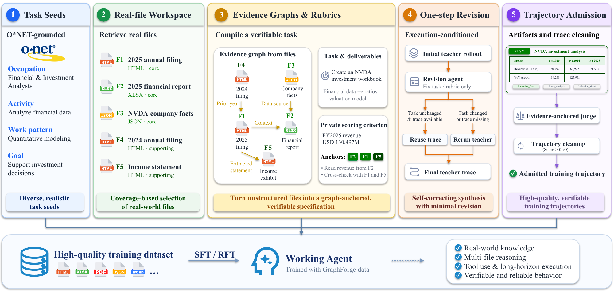

# GraphForge：从职业任务图生成办公训练环境

作者：Su, Qisheng、Wang, Hanchen、Zhu, Guanru、Jiang, Huicheng、Zhang, Qiuyinzhe、Shi, Kou、Fang, Zhen、Zhang, Ziao、Ren, Qingnan、Chen, Zehui、Gui, Tao、Zhao, Feng。arXiv:2609.38923 v1，提交日期 2026-09-30（原站日期）。预印本，未据模板推断录用。

为什么现在值得看：GraphForge 给出了新近实用的办公代理训练数据生产流程，以及文件级评测的收益和失败。作者实验，本站未运行；热度待验证。

普通合成问答缺少真实办公中的文件、角色和交付物。GraphForge 从 O*NET 的职业与工作活动图抽取任务锚点，把任务、评分规则和可操作文件共同生成，再让教师代理实际执行，按执行反馈修订。评分不合格的轨迹不会直接进入监督微调集。这里的关键不是多写一些指令，而是让“任务能做、环境可操作、产出可评”一起成立。

主流程从 3,638 个已实例化任务筛出 2,169 条高分 SFT 轨迹，涉及 2,150 个工作区，平均约 23.1 个文件、50 个助手步骤和 16.2 万 token。它因此也不是低成本的一轮问答生成器。论文对 Qwen3.6-27B 和 35B-A3B 使用同一语料；在 Claude Code 脚手架下，27B 的 SpreadsheetBench II 从 10.3 提高至 24.0，35B-A3B 从 2.8 至 19.3。GDPVal 的 Elo 为论文内部评估口径，不应与公开排行榜直接拼接。

最有用的边界在评分器。作者故意破坏输出时，删除整个工作表会明显降分，但若只损坏数字、行或引用，平均降幅不到 0.03。这说明高分办公轨迹仍可能携带细小但重要的错误。零精确文件重合与 n-gram 抽查降低了部分污染疑虑，也不等于排除所有语义泄漏。复用时优先补单元格、公式和引用的确定性检查，再考虑扩大数据规模。

Su, Qisheng 等，Figure 1，O*NET 锚点、任务与评分规则、文件工作区、教师执行构成同一数据流水线。来源论文原图，CC BY 4.0；用于解释本段方法或实验。（[来源原图](https://arxiv.org/abs/2609.38923v1)；[查看原尺寸](../../../frontiers/2026/10/2026-10-04/images/paper-graphforge.png)。）

[原始论文](https://arxiv.org/abs/2609.38923v1) · [版本许可](http://creativecommons.org/licenses/by/4.0/) · [归档 PDF](2609.38923v1.pdf)

英文摘要：Working agents need to read diverse files, coordinate tools, and produce deliverables. Training such agents requires tasks built on many real files with verifiable results, but few pipelines exist to synthesize this kind of data. Existing pipelines either generate files with models, which lack realism and diversity, or build tasks on real files without task-specific verifiers, leaving result quality unchecked. We introduce GraphForge, an evidence-graph based framework that grounds both the task and its verification in real files. Starting from occupation-grounded seeds for controlled diversity, GraphForge assembles a workspace of real files for each seed and builds an evidence graph over their relations. Since the task statement and rubrics are both derived from this graph, task requirements are backed by the workspace files and each criterion is anchored to the files needed to verify it. An initial rollout further tests executability, and a revision agent repairs the task and rubrics against the original files before trajectories are collected. Fine-tuning Qwen3.6-27B on 2,169 GraphForge trajectories brings GDPVal to 1445.7 (+65.7) under OpenHands, and Workspace-Bench-Lite and SpreadsheetBench II to 63.7 (+7.7) and 24.0 (+13.7) under Claude Code. Rejection fine-tuning on the SFT model's own rollouts, with candidates selected by the evidence-anchored rubrics, yields further improvements on all three benchmarks, suggesting that the rubrics provide a useful selection signal. The data and models are available.

归档为未改动的 v1 PDF；再分发依据该版本 CC BY 4.0，作者署名与许可保留。

[返回本期论文精选](../../../frontiers/2026/10/2026-10-04/03-论文精选.md)
