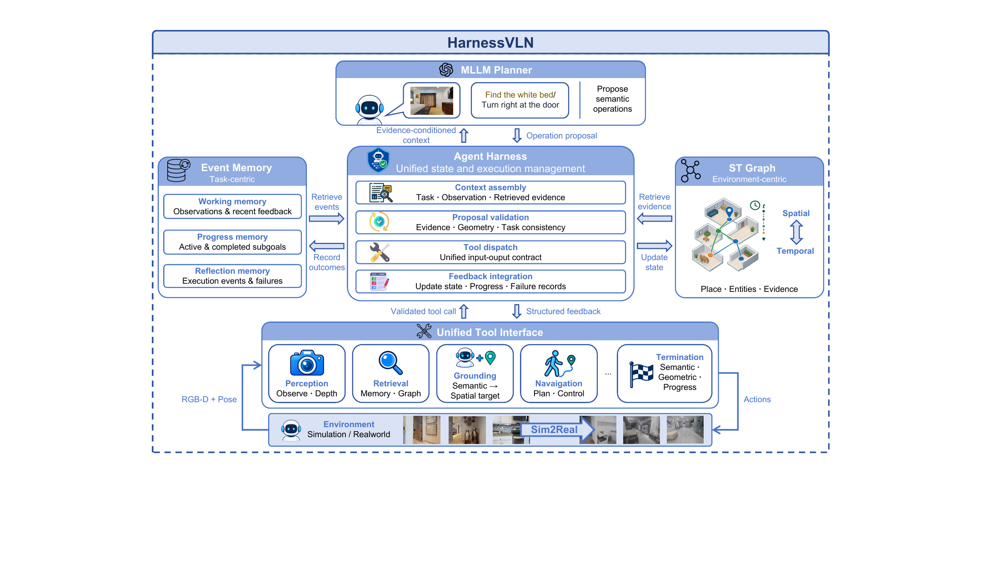

# HarnessVLN：让导航计划接受空间证据检查

作者：Chen, Yang、Che, Lirong、Huang, Zhenyu、Fu, Wenbo、Wang, Chuang、Cao, Xu、Liu, Daqi、Yang, Yuzhe、Su, Jian、Guo, Lan-Zhe。arXiv:2609.15195 v1，2026-09-14；本期按预印本阅读，不宣称已录用。

[原始论文](https://arxiv.org/abs/2609.15195v1) · [版本许可](http://creativecommons.org/licenses/by/4.0/)

入选：新近创新。已读原文方法与实验；本站未复现。

多模态模型提出“去冰箱旁边”并不说明路线可达，声称到达也不等于机器人站在正确位置。HarnessVLN 在规划器与执行器之间加入运行框架，先核对目标的视觉依据、几何可达性和当前子目标，再调用导航工具；执行后的结构化反馈又更新下一次决策。

记忆分成任务进展与空间图两部分。前者记录正在做什么及失败经过，后者积累地点、物体、观察时间与失败注记。模型提出停止请求时，还要同时通过语义、距离和进度检查。组件可替换，但所谓免训练是免任务特定导航训练，并非系统没有预训练模型或外部工具。

指令导航用 GPT-5.5，物体导航用 GPT-5.6-luna，搭配 RGB-D、GroundingDINO、SAM 等。R2R / RxR 成功率分别为 60.8% / 53.9%，HM3D-v2 / OVON 为 76.0% / 59.3%。比较横跨不同系统与基座，不能只用这些分数归因于某一个检查环节。

固定百条子集的累加消融更能看组件作用：事件记忆、图检索和停止检查逐步提升成功率，但 OVON 加停止检查后路径效率略降。更谨慎地核验有成本，成功率也不等于路线最短。真实机器人部分展示三类场景，没有足够规模支持普遍可靠性的结论。适合研究如何把完成声明绑定到观测，本站未复现仿真或机器人实验。

作者框架原图：规划器提出工具与目标，Harness 管理证据、记忆和执行反馈。重点看停止也要经过检查；工具链与空间传感器是方法成立的运行条件。（[作者原图](https://arxiv.org/abs/2609.15195v1)；[查看大图](../../../frontiers/2026/09/2026-09-17/images/paper-harness.png)。）

原始 PDF 按版本所列 http://creativecommons.org/licenses/by/4.0/ 保存，未改动内容。

[打开本站归档 PDF](2609.15195v1.pdf)

[返回本期论文精选](../../../frontiers/2026/09/2026-09-17/03-论文精选.md)
