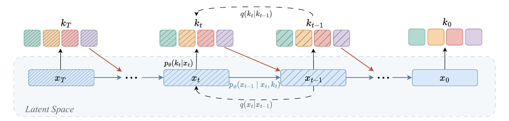

# HC-DLM：离散文字与连续隐状态一起去噪

作者：Ren, Hui、Li, Zihan、Liu, Chang、Liu, Huidong、Schwing, Alexander。arXiv:2610.02193 v1，提交2026-10-01。预印本。

新近创新 / 新近实用；热度待验证。已读核心原文，本站未训练复现。

离散扩散语言模型通常反复修订 token，连续方法则在向量空间逐步去噪。HC-DLM 保留一个持续演化的连续隐状态，每一步再解码出离散 token，作为下一步更新的“脚手架”。因此它不是每轮丢掉隐状态、只把旧文字重新喂回去。

训练目标联合重建、隐空间去噪与熵约束，防止编码器坍缩；具体实验使用条件流匹配。采样过程还会对预测出的干净 token 重新加噪。这个设计要回答的是：离散结构能否约束连续搜索，同时保留后者的表达能力。

在不含嵌入层、约 6M 生成参数的匹配设置中，Hard Sudoku 达到 72.41%，对照 CCDD 为 70.73%；Easy Sudoku 则是 94.21% 对 94.65%，并非全面领先。Countdown 的 CD5 上为 37.52% 对 25.35%。在 LM1B、序列长度 128、约 118M 参数且同样不含嵌入层的语言实验里，128 步采样的 GPT-2-large 生成困惑度为 75.5，优于文中的部分扩散对照，却仍差于自回归模型的 66.7。

为什么现在值得看：新方法把两类生成过程放在同一模型中，并给出小规模结构任务与语言任务对照。适合研究采样路径和训练约束；尚不能推断它会替代大规模自回归聊天模型，也需要把 128 步的推理成本计入比较。

Hui Ren 等，论文 Figure 1 推理原图：下方浅蓝色连续隐状态沿主路径持续更新；上方多色离散 token 由它解码，再成为后续去噪的条件。看循环关系，不要把两行理解成两个独立模型。整图引用，CC BY 4.0。（[作者原图](https://arxiv.org/abs/2610.02193v1)；[查看大图](../../../frontiers/2026/10/2026-10-03/images/paper-hcdlm.png)。）

[原始论文](https://arxiv.org/abs/2610.02193v1) · [版本许可](http://creativecommons.org/licenses/by/4.0/)

原文为CC BY 4.0，保存未改动的v1 PDF并保留作者和许可。
[归档PDF](2610.02193v1.pdf)

[返回本期论文精选](../../../frontiers/2026/10/2026-10-03/03-论文精选.md)
