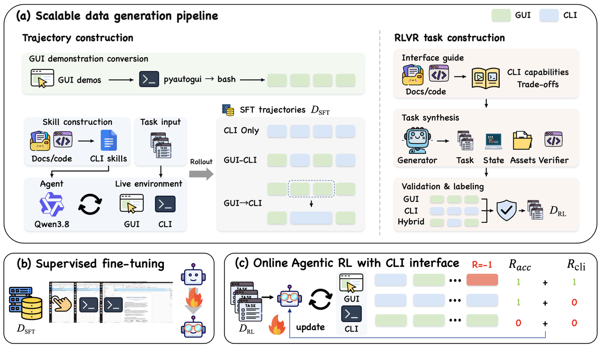

# HybridCUA：有命令行还不够，模型要学会何时使用

作者：Chen, Tongbo、Niu, Junbo、Lu, Zhengxi、Lian, Niu、Tang, Fei、Yan, Yuchen、Hong, Yike、Du, Yong、Liu, Yizhou、Chen, Bofan、Shen, Yongliang。arXiv:2609.38008 v1，提交2026-09-29。预印本。

新近创新 / 新近实用；热度待验证。已读核心原文，本站未训练复现。

直接给电脑操作模型增加命令行，可能让它更早失败。HybridCUA构建5000条GUI、CLI及交错轨迹，并准备3000个可程序验证的强化学习任务；先监督训练，再分别奖励合适的接口选择和可靠的命令执行。

以Qwen3.5-9B为底座、每题最多50步的OSWorld测试中，裸模型只用GUI为38.8%，直接加CLI反降到18.4%；训练后的HybridCUA为53.6%，平均14步。与同样训练的GUI分支相比，RL后的准确率为53.6对50.4，而非把全部14.8个百分点归因于“多一个接口”。WindowsAgentArena上从32.0到36.0，属于跨系统迁移证据。

为什么现在值得看：步骤更少可能是高效，也可能是提前失败，必须和完成率一起看。消融显示不同奖励分别影响接口使用和执行错误，但移除某项奖励并不总让准确率大幅下降。论文承诺开放数据与训练管线，发布状态应到项目页逐项确认；本站没有部署电脑控制模型，也未把训练效果当成任何命令都可靠。

作者方法原图。先看三类示范轨迹怎样进入SFT，再看任务与执行层面的奖励。它教的是接口选择与执行方式，不能简化为越多用CLI越好。（[作者原图](https://arxiv.org/abs/2609.38008v1)；[查看大图](../../../frontiers/2026/10/2026-10-01/images/hybridcua-method.png)。）

[原始论文](https://arxiv.org/abs/2609.38008v1) · [版本许可](http://arxiv.org/licenses/nonexclusive-distrib/1.0/)

arXiv非独占分发许可不直接授权本站再分发全文；本期保存阅读卡和原站链接，只引用一幅有署名的原图作方法评论。
[返回本期论文精选](../../../frontiers/2026/10/2026-10-01/03-论文精选.md)
