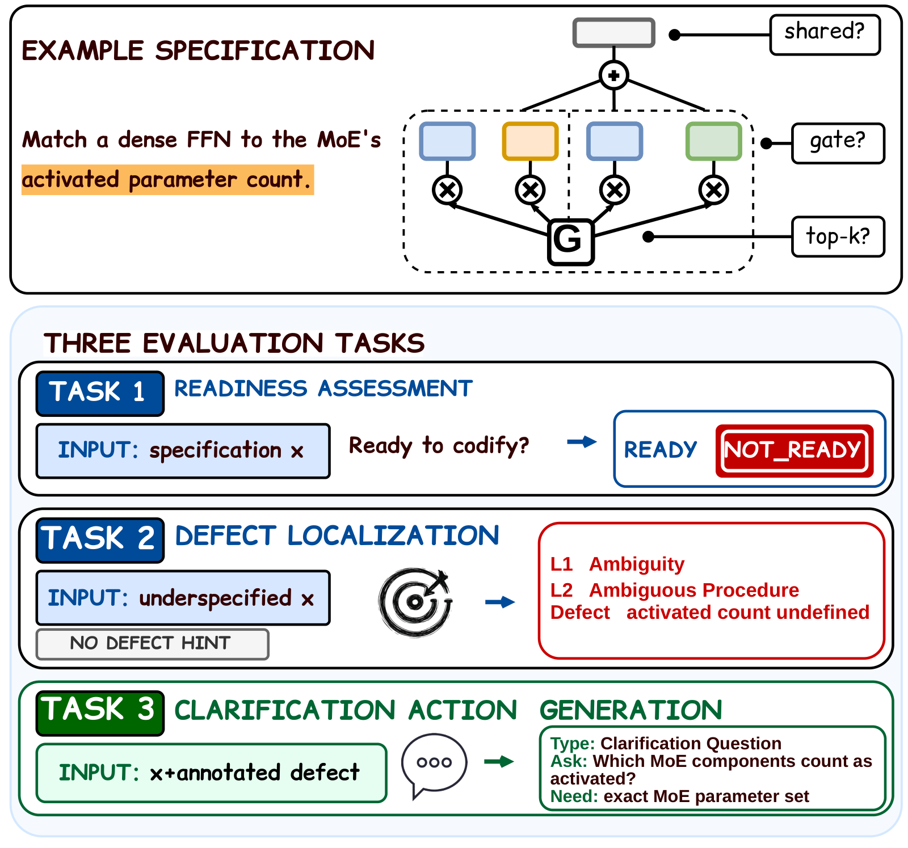

# IdeaAMBIG：会写代码，不代表找到了研究方案的缺口

原题：IdeaAMBIG: Benchmarking Implementation-Critical Gaps in Research-Idea Specifications

作者：Yiling Ma、Yilun Zhao、Sihong Wu、Manasi Patwardhan、Arman Cohan

[arXiv:2609.10539v1](https://arxiv.org/abs/2609.10539v1) · 2026-09-09T17:59:04Z 提交 · v1 预印本。本站阅读记录：2026-09-12。

## 研究问题与方法

一个研究想法可能听起来完整，写成代码时却必须偷偷补一个关键决定。IdeaAMBIG 专门检查这种缺口：评估模型能否判断方案已具备实现条件，定位没有定义清楚的细节，并提出有效澄清。数据共 660 项，其中 163 项来自真实复现材料，497 项是在完整方案中受控加入缺陷。

三个任务提供的信息不同。缺口定位只能看方案本身；澄清任务额外给出人工标注的缺口。论文比较 13 个模型，真实子集上，GPT-5.6-Sol 的缺口定位 Macro DRR 为 9.6；给定缺口后，澄清 Macro-CAS 达 80.6。二者不是同一指标，不能简单相减为能力增幅。

图｜来源原图。Yiling Ma 等，原文 Figure 1。例子要求把稠密网络匹配到 MoE 的激活参数量，但没有说共享专家、门控等是否计入。下面三步分别问：方案能否实现、缺口在哪里、已知缺口后该怎样澄清。第三步会额外得到标注缺口，不能把其高分当成端到端发现问题的能力。 原图按 CC BY 4.0 引用。 [原始来源](https://arxiv.org/abs/2609.10539)。点击图片查看原尺寸。

## 实验、结果与边界

更有说服力的是控制比较：同一模型、同一真实澄清子集，仅增加缺口信息，Macro-CAS 从 13.6 升至 80.6。另一个 20 项可执行研究中，提供正确澄清后的测试全通过率从 45% 升至 85%。但这里事先给了正确答案，测的是成功澄清的潜在价值，不是自主 Agent 已经达到 85%。

复现时应分别统计发现问题、问对问题和忠实实现。测试通过也可能实现了另一种合理方法，因此需要检查方法定义是否一致。样本存在同源聚类与单缺陷设计等限制；作者做了来源聚类分析，仍不能据此覆盖所有复杂研究方案。本篇是预印本。

## 复现时优先检查

- 模型是否真正定位了改变方法含义的缺口？
- 澄清时得到的额外信息与端到端设置是否一致？
- 执行测试是否同时检查了方法忠实度？

## 原文与归档

[站内固定版本 PDF](2609.10539v1.pdf) · [原始 PDF](https://arxiv.org/pdf/2609.10539v1)。arXiv 页面标注 [CC BY 4.0](https://creativecommons.org/licenses/by/4.0/)，本地归档保留完整原文、作者署名与原始许可，未修改 PDF。

[返回 9 月 12 日论文精选](../../../frontiers/2026/09/2026-09-12/03-论文精选.md)
