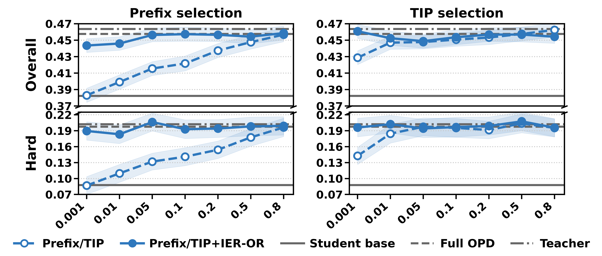

# IER-OPD：重要的 token，也可能给出嘈杂梯度

作者：Sheng, Huanxin、Ye, Zhiling、Wang, Haonan、Wang, Jian、Gu, Jinjie、Kang, Jian。arXiv:2609.24432 v1，2026-09-21。预印本，未宣称录用。

入选：新近创新；热度待验证。已读核心原文，本站未复现。

在策略蒸馏让学生沿自己的输出向老师学习。常见筛选器寻找“有用”的位置，例如双方分歧大、学生不确定；但一个位置即使值得学，单次采样给出的梯度也可能很不稳定。本文用信息效率比 IER 估计信号相对噪声的强弱，再与已有的重要性指标组合。

理论分析固定前缀下的梯度估计与最优基线；实际实现不遍历完整词表，而使用师生各自 top-k 候选和已采样 token 的并集近似。IER-AND 要求重要性和可靠性都高，IER-OR 则允许任一信号补足另一项。这些近似不是保证最优 token 集合的定理，和某些熵筛选器组合时也会变差。

数学实验包括 1.5B 同规模强弱模型蒸馏，以及 4B 到 1.7B 蒸馏，用 DAPO-Math-17k 进行 50 轮 rollout，报告 Bayes@32 而非单次正确率。医疗实验为 ClinAlign-4B 到 Qwen3-4B、100 轮训练，HealthBench 由 gpt-oss-120B 判分。极小预算下，部分 IER 组合接近或超过全 token 蒸馏，例如医疗总体分数在 0.1% 预算下接近 45.77 的全量基线；这不是临床有效性验证。

“1% token”指被选中施加监督的位置比例，不是总训练 FLOPs、老师调用或端到端时间只剩 1%。采样、打分和前向仍有成本。现在值得看的创新，是把“该不该学”和“这次梯度是否可靠”分开；复现时应同时记录时间、显存和最终任务分数。

作者 HealthBench 预算曲线（Figure 2）。横轴是监督 token 预算，阴影为 90% bootstrap 置信区间；比较同一基础筛选器加入 IER 前后，而不要把医疗基准分数当成患者效果。CC BY 4.0。（[作者原图](https://arxiv.org/abs/2609.24432v1)；[查看大图](../../../frontiers/2026/09/2026-09-23/images/paper-ier.png)。）

[原始论文](https://arxiv.org/abs/2609.24432v1) · [版本许可](http://creativecommons.org/licenses/by/4.0/)

此版本许可允许再分发（CC BY 4.0 或 CC0，见下方原始许可），本站保存未经修改的原始 PDF，保留作者、版本和来源。
[归档 PDF](2609.24432v1.pdf)

[返回本期论文精选](../../../frontiers/2026/09/2026-09-23/03-论文精选.md)
