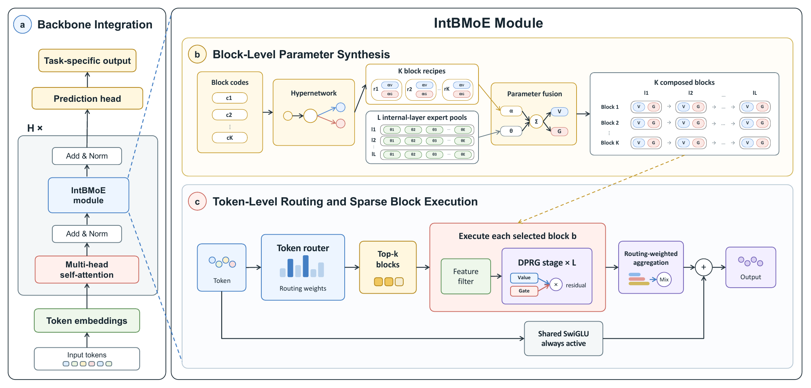

# IntBMoE：所有专家参与组装，每个 token 只执行少数块

作者：Cheng, Ran、Xu, Longfei、Liu, Zheng、Liu, Kaikui、Chu, Xiangxiang。arXiv:2609.21346 v1，2026-09-18。预印本，未宣称录用。

入选：新近创新；热度待验证。已读核心原文，本站未复现。

常规稀疏 MoE 每个 token 只执行少量专家，但也只有这些专家直接贡献输出；如果全部专家都执行，计算成本又会上升。IntBMoE 把“谁参与组成参数”和“token 运行哪些模块”分开：先通过固定大小的可学习码本，把全部专家基底组合成若干可复用计算块，再路由到少数块执行。

这些组合不依赖当前 token，因此参数固定后可以预先计算并缓存。块内部还有两条分别组合的路径，通过门控相乘增强表达；另有共享专家承担通用部分。这里的全参与是参数组合层面的定义，不意味着推理时对每个 token 逐个执行全部原始专家，也不意味着专家池可以无限增长而不占存储。

主要受控实验是 ImageNet-1K 上约 24M 参数、八层 DeiT-Tiny 风格主干，报告三随机种子的平均结果。IntBMoE Top-1 为 73.76%，相对对照 SMEAR 高 1.98 个百分点；batch=1 的计算量从未缓存的 4.063 GFLOPs 降到缓存的 3.457。它并不在该表中拥有最低 FLOPs，不能简化成既最省又最好。

语言建模、推荐和高德线上实验是额外证据；其中 2.4% 的 UVCTR 是相对提升，由作者报告，本站未核验生产日志。复现时应分别测训练组合成本、缓存占用和请求时开销，再判断这套取舍是否适合自己的模型规模。

作者 Figure 2。先看码本与专家池如何合成固定数量的块，再看 token 路由只选择部分块；共享专家是另外一条路径。限本条机制评论引用，图中全参与不等于逐 token 全执行。（[作者原图](https://arxiv.org/abs/2609.21346v1)；[查看大图](../../../frontiers/2026/09/2026-09-22/images/intbmoe-method.png)。）

[原始论文](https://arxiv.org/abs/2609.21346v1) · [版本许可](http://arxiv.org/licenses/nonexclusive-distrib/1.0/)

此版本采用 arXiv 非独占分发许可，不能据此推断本站获准再分发全文；本站只保存阅读卡，PDF 请到原站阅读。方法图在本页针对性技术评论中作有限引用，未改动数据或关系，不表示可任意再分发。
[返回本期论文精选](../../../frontiers/2026/09/2026-09-22/03-论文精选.md)
