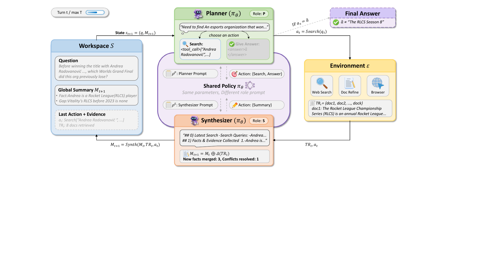

# IterSynth：搜索计划与中间总结，交给两个不同角色

作者：Wu, Xingyu、Yan, Yuchen、Lu, Zhengxi、Chen, Siqi、ZHANG, Xin、Liu, Aiting、Deng, Chao、Liu, Jie、Ma, Jin、Shao, Jian、Xiao, Jun、Shen, Yongliang。arXiv:2609.29444 v1，首发2026-09-24。预印本。

新近创新 / 新近实用；热度待验证。已读核心原文，本站未复现。

长程检索Agent常把搜索、记笔记和下结论塞进同一轮回答。IterSynth让Planner负责选择检索动作及决定何时结束，让Synthesizer专门整合新证据、更新持久摘要。两者共享同一Qwen3-8B模型权重，只通过角色和训练目标分工，不是两个不同规模模型组成的委员会。

每轮规划者读取当前综合摘要，再决定查询；综合者接收结果并修订摘要，不能自行检索或提前给最终答案。这样可避免不断携带全部原始历史，但被总结遗漏的证据也可能无法恢复。若早期错误被反复写进摘要，后续检索还可能顺着错误假设走。

作者先用约1万条轨迹监督训练，再用RDPO同时处理终局正确性和逐轮角色表现，把优势信号分配到相应角色。强化学习使用缓存检索，评估改为实时检索。五项基准平均50.7，对照MiroThinker-8B为46.5，相差4.2个百分点；这包含完整训练流程的贡献，不能全部归给“双角色”提示。

近期价值在于可复用的职责边界及过程奖励设计。额外综合调用和评价并不免费，论文约100步训练中的评价token达到19.2亿量级。复现时应同时记录正确率、总调用成本、摘要丢失和提前结束，尤其检查GAIA一类需要保留细小关系的任务。本文只核验原文与源文件，没有执行训练或在线搜索基准。

作者方法原图。Planner的搜索动作把新证据送给Synthesizer，后者更新综合摘要，再供下一轮规划使用；读图时区分职责分工和模型权重共享。CC BY 4.0。（[作者原图](https://arxiv.org/abs/2609.29444v1)；[查看大图](../../../frontiers/2026/09/2026-09-26/images/itersynth-method.png)。）

[原始论文](https://arxiv.org/abs/2609.29444v1) · [版本许可](http://creativecommons.org/licenses/by/4.0/)

采用CC BY 4.0，归档未改动的原版PDF，保留作者、版本和许可。
[归档PDF](2609.29444v1.pdf)

[返回本期论文精选](../../../frontiers/2026/09/2026-09-26/03-论文精选.md)
