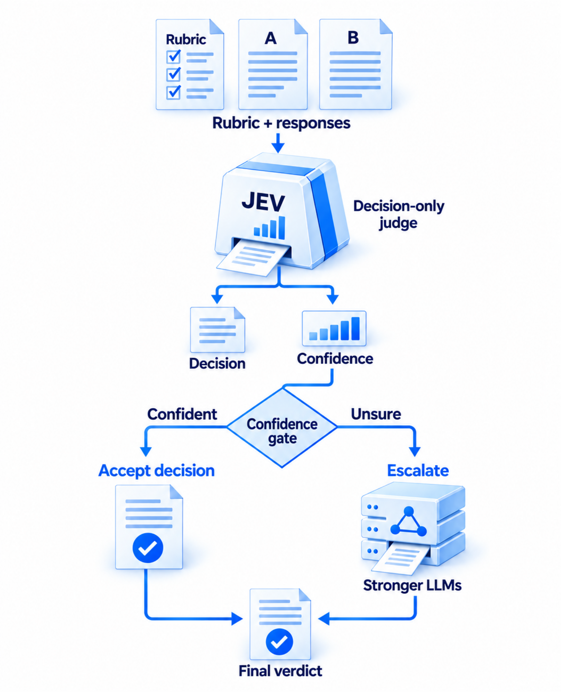

# JEV-as-a-Judge：小裁判什么时候该把题交出去

作者：Li, Yubo、Miao, Yidi、Krishnan, Ramayya、Padman, Rema。arXiv:2609.26550 v1，2026-09-22。预印本。

新近创新 / 新近实用；热度待验证。已读核心原文，本站未复现。

只输出结构化判断和概率，可以节省生成长解释的开销，但不意味着判断更正确。本文比较 JEV 1.13 与 16 个其他配置，在偏好、基于证据的事实判断和难题正确性之间划出不同适用范围；生成式裁判也接收相同的“标签与概率、不写理由”要求。

RewardBench 400 对、HaluEval 240 项和 JudgeBench 350 对的结果差异很大。普通偏好或带证据的事实判断接近强模型，难推理却明显落后：JudgeBench 上 JEV 为 78.6%，GPT-6 为 93.1%。华丽但错误的答案也会误导小裁判。没有参考证据的自由文本判断中，所测模型接近随机且仍很自信。

较严谨的级联实验先在 96 对选择集固定门槛，再在 510 对扩展集测试；两次交换顺序的概率先对齐再平均。门槛 0.9 时接受 53.7% 的小裁判结果，级联准确率 92.5%，强模型单独为 93.1%；报告费用为其 56.8%，保守缺失计费界为 62.2%。这才是“保留约 99% 准确率”的分母，不是绝对 99% 正确率。

级联是离线模拟，未测真实串行延迟；部分门槛迁移失败。人工复核也只是作者中一人对分歧项盲审，不是大规模独立专家共识。现在值得复用的是按任务验证门槛、把无效输出计为失败、同时报告错误与成本的实验方法。

作者级联图（Figure 4）：置信度决定接收或转交，最终判断来自对应分支。门槛应在独立选择集确定；概率高不是正确证明。CC BY 4.0。（[作者原图](https://arxiv.org/abs/2609.26550v1)；[查看大图](../../../frontiers/2026/09/2026-09-24/images/jev-cascade.png)。）

[原始论文](https://arxiv.org/abs/2609.26550v1) · [版本许可](http://creativecommons.org/licenses/by/4.0/)

版本采用 CC BY 4.0，保留作者与版本归属。
[归档 PDF](2609.26550v1.pdf)

[返回本期论文精选](../../../frontiers/2026/09/2026-09-24/03-论文精选.md)
