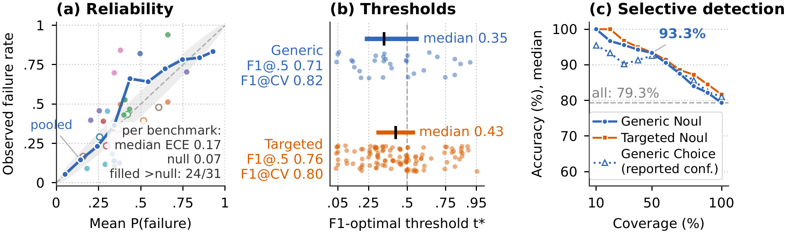

# Just Ask Jev：能把失败排在前面，不代表概率已经校准

作者：Guo, Ruoqi、Liu, Yi、Deng, Gelei、Li, Yuekang、Zhao, Lida、Wu, Yutao、Chen, Simin、Zhang, Ying、Zhang, Leo Yu。arXiv:2609.29429 v1，arXiv提交2026-09-24。预印本。

新近创新 / 新近实用；热度待验证。已读核心原文，本站未复现。

这项研究把闭源Jev 1.13 API作为零样本失败检测器，输入任务或输出，让它估计出现某种对齐失败的概率。评测收集44个基准、7193个实例、十类失败；少数类不足的任务被排除，部分统计只覆盖38个。标签有规则、模型裁判及人工核对等不同来源，不能统称全部为人类金标准。

通用提示在31项可比较数据上的AUROC中位数约0.886；定向提示在38项上约0.911，两者分母不同，不宜直接相减当提升。严格留出的定向措辞收益约0.006，置信区间跨零；根据同一数据选择提示会带来更大的乐观偏差。因此“换一段聪明提示就稳定更好”并不由这些数字保证。

另一关键是排序与校准：把更危险样本排前面，可以得到较好AUROC，却未必能相信它报出的80%概率。论文合并数据的ECE约0.047，逐基准中位数却约0.168；把不同任务混在一起，会掩盖某一具体任务的偏差。

阈值也不能照搬。在一组数据中交叉验证阈值让F1从0.706到0.822，但仅看验证标签的子集，结果反而从0.721降到0.694。现在值得借鉴的是把模型分数接入本地校准和标签审查，而非将一个远端模型视作通用可靠裁判。本站已读方法和分组结果，没有调用API复现；服务版本和成本仍会影响可复现性。

Just Ask Jev图5，CC BY 4.0。左图对比合并与逐任务校准，中图展示任务阈值分散，右图是减少覆盖后的准确率；丢弃不确定样本会改变覆盖率，不能只报准确率上涨。（[作者原图](https://arxiv.org/abs/2609.29429v1)；[查看大图](../../../frontiers/2026/09/2026-09-28/images/jev-calibration.png)。）

[原始论文](https://arxiv.org/abs/2609.29429v1) · [版本许可](http://creativecommons.org/licenses/by/4.0/)

采用CC BY 4.0，归档未改动的原版PDF，保留作者、版本和许可。
[归档PDF](2609.29429v1.pdf)

[返回本期论文精选](../../../frontiers/2026/09/2026-09-28/03-论文精选.md)
