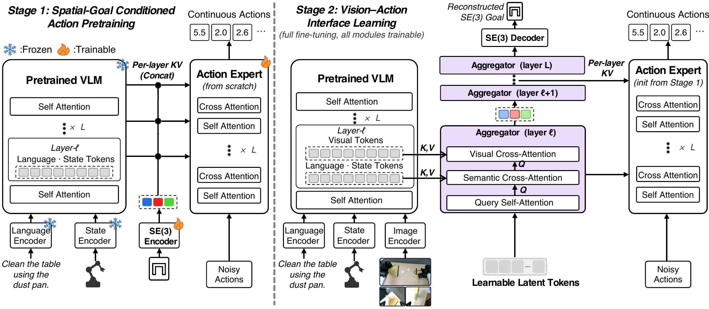

# LIT：先学动作结构，再让视觉补进来

作者：Lin, Jianman、Shailesh, Shailesh、Luo, Zhongyi、Duan, Jiafei。arXiv:2609.12641 v1，2026-09-11；本次按预印本阅读，未核实录用状态。

[原始论文](https://arxiv.org/abs/2609.12641v1) · [版本许可](http://arxiv.org/licenses/nonexclusive-distrib/1.0/)

视觉语言动作模型容易同时面对“理解画面”和“学会动作”两类困难。LIT 首先用语言、状态与末端执行器的 SE(3) 位姿监督训练动作部分；SE(3) 可以直观理解为三维位置加朝向。第二阶段再通过具有位姿监督的视觉聚合模块把图像接入，让视觉信息在受约束的中间表示中帮助动作预测。

论文比较四类架构，并固定预训练骨干、从随机初始化动作专家开始，控制优化步数。因此主要回答的是这套训练次序是否有益，不能把它与直接微调一套现成 VLA 权重的结果无条件比较。LIBERO 使用四十个任务、每任务五十次；扰动测试与真实机器人实验另有各自设置。

作者报告分布外测试提升约 3.87–10.70 个百分点，三项真机任务提升约 13.30–16.70 个百分点。范围对应不同设置，并不意味着任意机器人都能获得类似收益。适合关注训练稳定性与动作表示的读者；复现时需检查两个阶段的数据、位姿表示和参数冻结方式，避免额外监督量不同造成不公平对比。

第一阶段暂不接入图像，训练位姿与动作关系；第二阶段把视觉经聚合模块接入。图中的冻结标记解释了哪些组件在何时更新。（[作者原图](https://arxiv.org/abs/2609.12641v1)；[查看大图](../../../frontiers/2026/09/2026-09-15/images/paper-lit.png)。）

本版本为 arXiv 非独占分发许可，不等于允许本站重新分发全文，因此只归档阅读卡；上图限本条方法评论引用。

[返回 2026-09-15 论文精选](../../../frontiers/2026/09/2026-09-15/03-论文精选.md)
