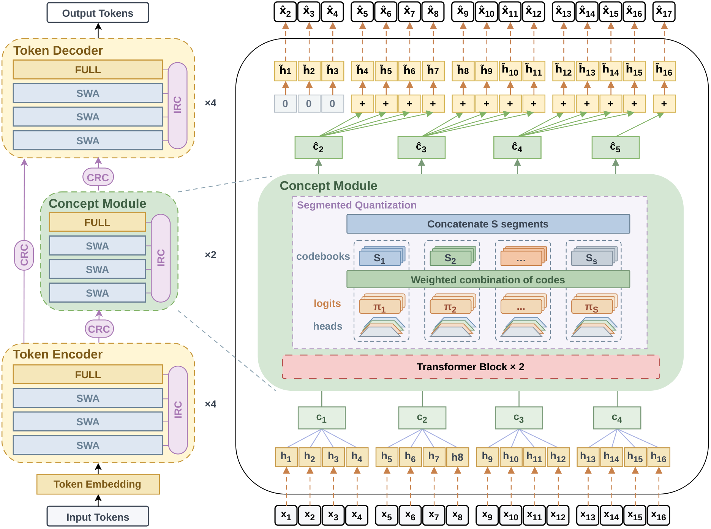

# NCP-ArchPreview：在 token 之间插入较慢的概念预测层

原题：NCP-ArchPreview Technical Report: Moving towards Latent Space Language Models through Next Concept Prediction

作者：Intern-NCP Team（Jiaqi Cao、Chiyu Chen、Shuang Cheng 等）

[arXiv:2609.10715v1](https://arxiv.org/abs/2609.10715v1) · 2026-09-09T18:12:43Z 提交 · v1 预印本。本站阅读记录：2026-09-12。

## 研究问题与方法

一般语言模型每一步都预测下一个 token。NCP-ArchPreview 试着在内部增加较慢的计算节奏：先把连续 token 的表示汇成一组，再预测下一组的潜表示，最后仍由 token 解码器输出文字。这样，模型既保留细节生成，又能在较短的序列上学习更大范围的变化。

具体方法包含 Token Encoder、Concept Module 与 Token Decoder。成组表示经过乘积向量量化，概念模块预测码本的加权组合；预测结果经过因果位移再传给后续 token，联合使用 token 预测、概念预测与量化损失训练。它不是把每句话人工贴上一个标签，也不是输出时一次吐出整句。

图｜来源原图。Intern-NCP Team（Jiaqi Cao，原文 Figure 2。先沿左侧从下到上读三个模块，再看右侧放大图：每组 token 表示形成一个概念，概念模块预测下一组的信息，随后通过位移和重复送回解码器。绿色箭头没有让后文泄漏给前文；因果对齐是关键。这里的 concept 是训练得到的潜表示，并不保证对应人能命名的概念。 [原始来源](https://arxiv.org/abs/2609.10715)。点击图片查看原尺寸。

## 实验、结果与边界

报告将 8.9B 模型在 5.73T token 的训练与 OLMo-3-7B 等基线比较，其中达到相近最终 token 预测损失所需 token 数为基线的 51.3%。两者参数规模不同，这个数不能直接改写为训练时间或成本减半。论文还提供对齐规模、计算预算的控制实验，帮助区分架构与投入规模的影响。

复现应先检查组大小、码本规模、位移方式和训练预算，再比较验证损失与下游任务。小型草稿模块的接受长度也不能直接当作用户看到的加速倍数。本文是预印本技术报告；本站阅读了方法、实验与限制，未训练模型。

## 复现时优先检查

- 概念预测与 token 解码如何保持因果性？
- 将参数量和训练计算对齐后，优势还剩多少？
- 较低验证损失是否转化为任务质量或实际推理加速？

## 原文与归档

[原始 PDF](https://arxiv.org/pdf/2609.10715v1) · [HTML 原文](https://arxiv.org/html/2609.10715v1)。arXiv 页面标注[非独占分发许可](https://arxiv.org/licenses/nonexclusive-distrib/1.0/)，它并未直接授予本站全文再分发许可，因此保存原创阅读卡与必要的图形引用，不托管整篇 PDF。

[返回 9 月 12 日论文精选](../../../frontiers/2026/09/2026-09-12/03-论文精选.md)
