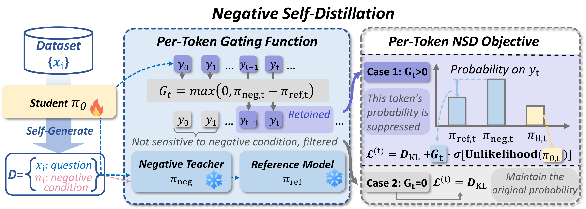

# Negative Self-Distillation：从受误导的分布中找出该压低的 token

原题：Negative Self-Distillation: Learning to Reason by Avoiding Flaws

作者：Rongcan Pei、Zhepei Wei、Shuyao Xu、Xinyu Zhu、Wei-Lin Chen、Yu Meng

[arXiv:2609.11699v1](https://arxiv.org/abs/2609.11699v1) · 2026-09-10T15:24:17Z 提交 · v1 预印本。本站阅读记录：2026-09-12。

## 研究问题与方法

让模型模仿带有标准答案的推理，可能把过度自信的路径也一起学进去。NSD 换了一个方向：先生成能诱发缺陷的负面条件，比较模型在负面条件和正常条件下的 token 分布，再抑制那些被负面条件异常放大的选择。训练过程不需要题目的标准答案，也不依赖外部更强教师。

关键不是惩罚整段错误回答。门控 G=max(0, p负面−p参考) 隔离受负面条件影响的位置，有界的 unlikelihood 项降低这些 token 的概率，KL 项尽量保住原来的语言行为。否则，标点、连接词和合理的探索步骤也可能随错误答案一起被压低。

图｜来源原图。Rongcan Pei 等，原文 Figure 2。看中间的门控式：只有负面条件让某个 token 的概率额外升高时，才施加对应抑制。右下 G=0 的分支仍受 KL 约束，不会因为出现在错误回答中就被一并删掉。雪花表示教师冻结，火焰表示学生更新。 原图按 CC BY-SA 4.0 引用。 [原始来源](https://arxiv.org/abs/2609.11699)。点击图片查看原尺寸。

## 实验、结果与边界

论文在 MATH 问题上训练 Qwen3 1.7B、4B、8B，评估七个数学基准。主要结果采用非思考模式，每题八次采样取平均正确率 Avg@8，三个规模分别提高约 2.3、7.5、6.0 个百分点。这个口径不同于“八次里至少一次答对”的 pass@8，不能混用。

实验主要检验数学推理，负面条件的质量和门控选择会影响结果；反思词出现频率只能提供行为线索。复现时先固定采样温度、输出长度和检查点选择方式，再比较不加门控、没有负面条件等消融。本文为 v1 预印本，本站未运行训练。

## 复现时优先检查

- 负面提示改变的是错误推理，还是一般文风？
- Avg@8 和 pass@8 的提升是否一致？
- 门控是否保护了语言结构和有效的自我修正？

## 原文与归档

[站内固定版本 PDF](2609.11699v1.pdf) · [原始 PDF](https://arxiv.org/pdf/2609.11699v1)。arXiv 页面标注 [CC BY-SA 4.0](https://creativecommons.org/licenses/by-sa/4.0/)，本地归档保留完整原文、作者署名与原始许可，未修改 PDF。

[返回 9 月 12 日论文精选](../../../frontiers/2026/09/2026-09-12/03-论文精选.md)
