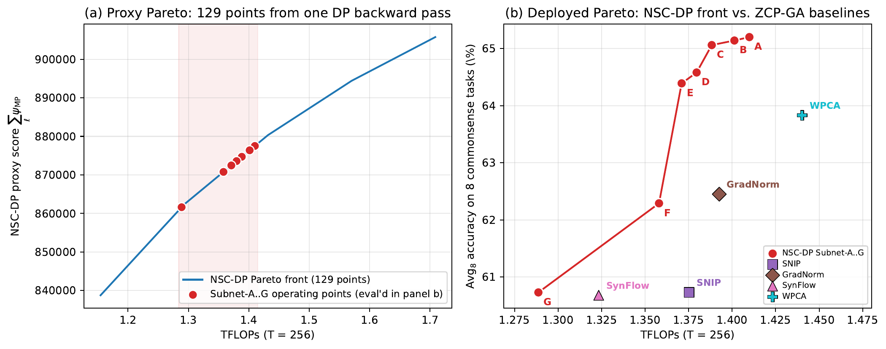

# Neural Spectral Capacity：先用数学代理筛架构，再验证真实能力

作者：Zhu, Chenyu、Zhao, Ruoyu、Lu, Zhichao。arXiv:2609.23087 v1，arXiv提交2026-09-19；近期补充（近30天）。预印本。

新近创新 / 新近实用；热度待验证。已读核心原文，本站未复现。

Neural Spectral Capacity为网络设计一个可加的谱指标：单个矩阵计算log det(I+WᵀW)，也就是把奇异值平方加一后取对数求和。作者借助随机矩阵的渐近规律，从尺寸和初始化方差直接近似这个分数，避免先实例化并训练大量候选网络。

指标借用了高斯信道容量的直觉，但不是证明整个带非线性的神经网络等于一条高斯信道。逐层相加是代理设计，归一化、非线性和嵌入等也未被完整建模；随机初始化的独立性与大维条件不能随意推广到任意训练后权重。

在分数和资源成本可加、候选离散化的条件下，动态规划可以找出给定网格的最佳代理分数。但“全局最优”针对的是这个指标，不是测试集准确率。FlexiBERT500的参数量近似匹配比较中，代理与表现的相关性高于只数参数；这支持筛选用途，不等于每次排名都正确。

作者报告TXL约40M配置的困惑度23.087，对照38M为23.279，搜索约2秒CPU时间；训练成本没有算进去。LLaMA超网实验约5.7B子网平均65.47，对照方法63.83，未剪枝模型69.72；0.46秒搜索也不包含建立预训练超网。9月19日原文作为近期补充入选，价值在于快速提出候选，再花训练预算验证，而非跳过实验宣布架构已经最优。

Neural Spectral Capacity作者的Pareto原图，CC BY 4.0。左侧蓝线是代理指标与计算预算的前沿，右侧红点是选定子网的实际任务表现；两边纵轴不同，说明代理最优与实测最优必须分开。（[作者原图](https://arxiv.org/abs/2609.23087v1)；[查看大图](../../../frontiers/2026/09/2026-09-28/images/nsc-pareto.png)。）

[原始论文](https://arxiv.org/abs/2609.23087v1) · [版本许可](http://creativecommons.org/licenses/by/4.0/)

采用CC BY 4.0，归档未改动的原版PDF，保留作者、版本和许可。
[归档PDF](2609.23087v1.pdf)

[返回本期论文精选](../../../frontiers/2026/09/2026-09-28/03-论文精选.md)
