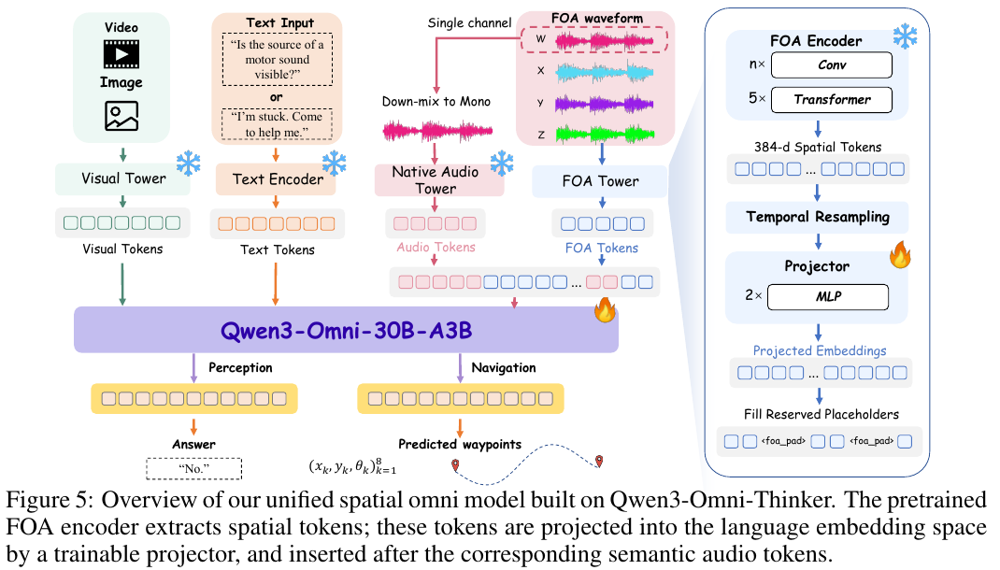

# OmniEcho：声音不只告诉你“是什么”，还告诉你“在哪里”

作者：Liu, Ruixun、Wang, Yuxuan、Xie, Jiacheng、You, Yuhuan、Cai, Donghua、Lin, Junming、Chen, Xiong-Hui、Guo, Zhifang、Chu, Yunfei、Yang, Qize、Cheng, Xize、Xu, Jin、Zhong, Yiwu。arXiv:2609.23407 v1，首发2026-09-20。预印本。

新近创新 / 新近实用；热度待验证。已读核心原文，本站未复现。

普通单声道输入能保留“有人说话”的语义，却会损失声源来自哪个方向的信息。OmniEcho在Qwen3-Omni-30B-A3B旁增加一条FOA空间音频支路；FOA包含四个声场通道，作者将其编码成带空间线索的token，再与原有音频语义token一起交给语言模型。原来的单声道路径保留，避免把空间与语义压进同一接口。

训练先用10万段合成声音场景对齐语义，再学习文字指定声源的方位、俯仰和距离，最后将冻结的空间编码器接入多模态主干。评测覆盖197个真实录制空间视听场景、2972组问答，以及来自30个环境的900项导航样本。它同时提供数据与任务定义，比单独展示“能听声找人”更容易定位错误。

音频加视觉问答的总体分数为28.5，对照Qwen3-Omni为18.5；但三维定位子项仍只有14.2。导航中FOA方法成功率16.2%，双耳SoundSpaces对照5.4%；文本指令导航是另一种输入条件，不应把不同引导方式的数字直接排成公平榜单。导航任务使用真实录音场景构建的评测，不是通用实体机器人部署证明。

现在值得借鉴的是空间与语义两条路径的接口设计，以及按任务拆分的诊断。复现应先验证FOA通道约定、同步与朝向，再看定位和闭环导航能否一起改善。源码包读取失败后本期改读PDF，图与正文均来自原文；没有将合成训练数据与真实场景测试混为一谈。

Ruixun Liu等人的图5，截取PDF第6页的完整图和图注，已注明裁切；[完整原页](https://arxiv.org/pdf/2609.23407v1#page=6)。粉色是保留的语义音频路径，蓝色是新增空间路径；右侧编码器输出再投影成主干可读的token。火焰与雪花区分训练和冻结部分，不能理解成两路音频都重新训练。（[作者原图](https://arxiv.org/abs/2609.23407v1)；[查看大图](../../../frontiers/2026/09/2026-09-27/images/omniecho-method.png)。）

[原始论文](https://arxiv.org/abs/2609.23407v1) · [版本许可](http://arxiv.org/licenses/nonexclusive-distrib/1.0/)

arXiv非独占分发许可不直接授权本站再分发全文，因此仅归档阅读卡与原站链接；单幅原图限本条方法或实验评论引用。
[返回本期论文精选](../../../frontiers/2026/09/2026-09-27/03-论文精选.md)
