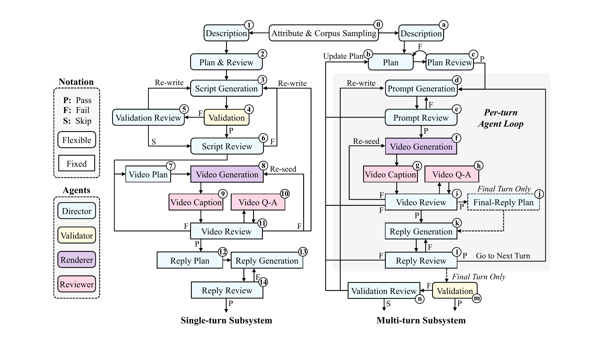

# OmniVChat：用合成音视频对话训练更短且切题的回答

作者：He, Haolin、Chu, Yunfei、Chen, Qi、Huang, Wen、Feng, Yuan、Zhu, Muzhi、Dai, Zheqi、Xu, Haoning、Yang, Dongchao、Wu, Chunyat、Liang, Zining、Liu, Zhengxi、Li, Xiquan、Chen, Xie、Cheng, Xize、Yang, Qize、Xu, Jin、Kong, Qiuqiang。arXiv:2609.21465 v1，2026-09-18。预印本，未宣称录用。

入选：新近创新；热度待验证。已读核心原文，本站未复现。

OmniVChat 将用户的视频与音频直接交给模型，不另给文字问题，也不先调用外部字幕或语音识别系统。输出仍是文本，所以它不是一套已验证的端到端语音生成方案。难点在于，回复可能需要同时理解用户说的话、身边物体、表情和连续对话状态。

作者用多阶段数据生成器规划、生成、检查并修复单轮和多轮对话，为每条回复设置分层评分准则。强化学习使用 Qwen3-Omni-30B-A3B-Instruct 的 Thinker 和 rank-64 LoRA，训练 1000 步，每次 32 个输入、每个输入采样四个回复。奖励同时考虑正确性、表达效率和风格，而不是无条件奖励更短。

训练集为 5600 段合成对话，开发集 560 段用于挑选检查点。独立合成测试集上，按 17 个子类等权汇总的分数从 0.465 到 0.652；360 段真人录制的单轮测试从 0.402 到 0.632。最终评估的平均回复长度由 79 降至 36 个计数字词，不应与训练曲线中另一组长度均值混用。

这说明受控合成数据可能迁移到真实录制输入，但尚不能覆盖开放世界、多轮真人对话和所有语言。评价还依赖评分准则与模型裁判。论文正文写的是将公开代码和数据；本期核对了研究仓库，但不把计划中的全量发布当成已经可复现所有实验。

作者 Figure 2，CC BY 4.0。左为单轮数据生成，右为多轮状态延续；彩色节点表示不同角色，返工箭头说明合成视频和参考答案也要被检查。原图较密，请结合上文四个步骤或点击大图阅读。（[作者原图](https://arxiv.org/abs/2609.21465v1)；[查看大图](../../../frontiers/2026/09/2026-09-22/images/omnivchat-method.png)。）

[原始论文](https://arxiv.org/abs/2609.21465v1) · [版本许可](http://creativecommons.org/licenses/by/4.0/)

此版本为 CC BY 4.0，本站保存未经修改的原始 PDF，保留作者、版本和来源。
[归档 PDF](2609.21465v1.pdf)

[返回本期论文精选](../../../frontiers/2026/09/2026-09-22/03-论文精选.md)
