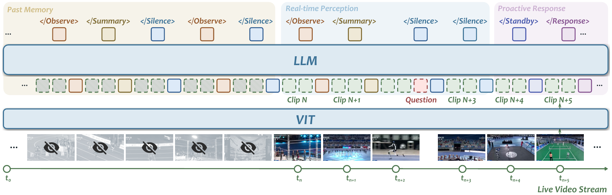

# OneStreamer：把旧画面变成带时间的记忆

作者：Zeng, Xiangyu、Yang, Yuandong、Zhang, Zhiqiu、Zhu, Yuhan、Li, Xinhao、Si, Qingyi、Yao, Dingyu、Ma, Changlian、Chen, Haoran、Chen, Xinyu、Shi, Yansong、Zhou, Junhao、Li, Yifei、Zhang, Jun、Qin, Chuanyu、Yang, Chenxu、Yu, Xinlei、Ouyang, Kun、Shao, Yuchen、Wei, Qianshan、Zhou, Changhai、Gao, Jun、Wang, Jiaqi、Wang, Limin。arXiv:2610.01762 v1，提交2026-10-01。预印本。

新近创新 / 新近实用；热度待验证。已读核心原文，本站未训练复现。

持续视频助手不能提前知道用户下一刻会问什么，也不能把过去所有帧永远放进上下文。OneStreamer 留下最近 16 帧的视觉信息，将更早内容压成带时间的局部观察和事件摘要。直觉上，眼睛看眼前，笔记保留过去；模型还学习在沉默、等待更多证据、回答之间切换。

它的另一项改动是 PSTL：保留全部输出锚点，并平衡状态改变与状态持续的监督，最终只给约 27.5% 的状态 token 计算这部分损失。这是在改训练监督密度，并非把输入序列直接缩短到四分之一。实验以 Qwen3-VL-4B-Instruct 为底座，冻结视觉模块及投影层，使用 32 张 H200 进行一次完整训练。

同一检查点的记忆消融中，只留 16 帧的 FIFO 在 ASI 上为 63.5，加入 PHCM 后为 71.6；另一个 EPM 指标为 62.6，仍低于完整上下文的 63.0。对一个 360 秒样例，H200 上回答阶段的首 token 延迟由 4.560 秒降到 0.124 秒，峰值显存由 25.18 GB 降到 9.98 GB；这里记忆已预先算好，不能据此宣称整个实时系统提速 36 倍。

为什么现在值得看：这份新研究给持续感知提供了可拆开的实现路线——保留多少原始视觉、怎样概括过去、什么时候开口。代价也明确：字幕漏掉的细节无法凭空找回，错误摘要还可能沿时间传播。适合先复查作者的同检查点消融，再研究自己的长视频任务。

Xiangyu Zeng 等，论文 Figure 3 方法原图：左侧旧帧不再保留完整视觉，局部观察与事件摘要进入分层记忆；右侧最近帧支持当前判断。注意“等待”也是模型输出状态。整图引用，CC BY 4.0。（[作者原图](https://arxiv.org/abs/2610.01762v1)；[查看大图](../../../frontiers/2026/10/2026-10-03/images/paper-onestreamer.png)。）

[原始论文](https://arxiv.org/abs/2610.01762v1) · [版本许可](http://creativecommons.org/licenses/by/4.0/)

原文为CC BY 4.0，保存未改动的v1 PDF并保留作者和许可。
[归档PDF](2610.01762v1.pdf)

[返回本期论文精选](../../../frontiers/2026/10/2026-10-03/03-论文精选.md)
