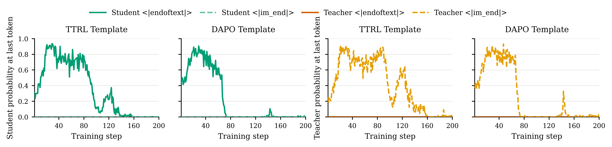

# EOS 不一致：学生已经想停，老师却把它当成错误

作者：Yang, Yuxiao、Yu, Tianrun、Li, Shangzhe、Zhao, Kaixiang、Zhang, Xuchao、Bansal, Chetan、Yao, Huaxiu、Killian, Taylor W.、Zhang, Weitong。arXiv:2609.20511 v1，2026-09-17；按预印本阅读，不宣称录用。

[原始论文](https://arxiv.org/abs/2609.20511v1) · [版本许可](http://arxiv.org/licenses/nonexclusive-distrib/1.0/)

入选：新近创新，热度待验证。已读原文核心方法与结果；本站未复现训练或大型评测。

在策略蒸馏让学生先生成，再用老师的概率信号指导学习。如果学生与老师偏好的结束token不同，学生正确地结束回答，也可能得到很低的教师概率。论文强调：两者即使共享词表，预训练与后训练形成的停止习惯仍可能不同。

把两种EOS都加入解码器停止列表，还不能解决这个问题。解码器知道遇到它就停，不等于模型愿意生成它；老师偏好的另一种EOS可能在学生端几乎没有概率。方法将各自多个结束token的概率相加，按同一个语义事件STOP比较，让停止动作的反馈不再取决于具体按钮名称。

作者在Qwen3、Llama3.2和Gemma3家族内部的数学蒸馏设置中分析，Qwen设置包含1.7B基础学生与4B老师。主要报告Avg@16等重复回答的平均表现，不能改写成十六次中任意一次成功率。对齐能够缓解停止概率塌缩，但其他原因仍可能造成回答变长，部分较长训练仍出现后续退化。

原图跟踪同一最终输出前缀上的EOS概率，帮助定位分歧；它不是所有任务自然终止的总体比例。复现价值在于训练前核对词表、停止配置与两边的真实概率，而非只改max_tokens。作者给出[项目说明](https://uncsciml.github.io/opd-eos-website)，本站未跑蒸馏训练；[技术实践](../../../frontiers/2026/09/2026-09-19/05-技术实践.md)仅用一个合成概率例子计算错误信号，不重复论文评测。

作者EOS概率原图：先比较教师和学生偏好的结束token，再看概率如何随训练变化。观察单位是指定输出前缀上的token概率，不是整个数据集的停止成功率。（[作者原图](https://arxiv.org/abs/2609.20511v1)；[查看大图](../../../frontiers/2026/09/2026-09-19/images/eos-probabilities.png)。）

原版本仅授予arXiv非独占分发权，本站不再分发全文PDF；原图限本条研究评论所需引用，保留作者与来源。

[返回本期论文精选](../../../frontiers/2026/09/2026-09-19/03-论文精选.md)
