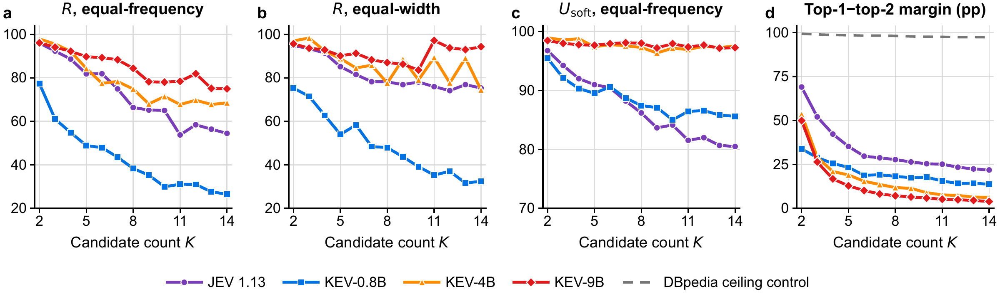

# Ordinal Scale Bias：给模型更多等级，它未必真的使用这些等级

作者：Gao, Tianxiang、Li, Jinzhe、Li, Zhiyuan、Chang, Yi、Wu, Yuan。arXiv:2609.38827 v1，提交2026-09-30。预印本。

新近创新 / 新近实用；热度待验证。已读核心原文，本站未训练复现。

把质量分成 1—5 档与分成 1—14 档，并不只是多给几个标签。论文研究 JEV 1.13 和 KEV 三个规模，在 40 个数据集、每集最多 5000 条的评估中发现：有顺序、语义相邻的等级容易被挤到少数输出；语义彼此独立的类别较少出现同样程度的收缩。

作者用 R 比较预测与真值分布的“有效类别数”：先对类别频率算熵，再取指数，最后相除。R 衡量用了多宽的输出空间，**不是正确率**。在同一批 1400 条样本上，把连续分数等频切成 2 至 14 档，JEV 的 R 从 95.9% 降至 54.5%；KEV-0.8B 从 77.3% 降至 26.5%。对同一题打乱候选顺序能改善部分结果，却没有消除整体收缩。

BA-LoRA 用 3.2 万条有序任务样本继续训练。KEV-4B 在未见来源上也有改善；0.8B 的迁移较混合，不能据训练来源提升就认定所有评分任务都修好了。R=100% 同样不能保证质量：两种分布可能频率一样，但每条都错配，所以必须同时看准确率和总变差距离 TVD。

为什么现在值得看：近期直接决策模型密集出现，这篇给出了比单一准确率更细的验收办法。限制是只覆盖一个托管系统与一个开放家族，两次随机排列不足以穷尽顺序敏感性；DBpedia 对照接近满分，未做到难度匹配，部分既有训练集的样本级重叠也未审计。本站在[技术实践](../../../frontiers/2026/10/2026-10-02/05-技术实践.md)用可运行的合成例子解释这些指标，不冒充复现作者模型。

作者图 3，限本条研究评论引用，完整保留坐标与图例。优先看 a：同样的文本，候选等级 K 变细后 R 下降；c 的概率分布仍可能较宽，说明取最大概率这一决策步骤也值得检查。R 轴不是准确率。（[作者原图](https://arxiv.org/abs/2609.38827v1)；[查看大图](../../../frontiers/2026/10/2026-10-02/images/ordinal-scale.png)。）

[原始论文](https://arxiv.org/abs/2609.38827v1) · [版本许可](http://arxiv.org/licenses/nonexclusive-distrib/1.0/)

arXiv非独占分发许可不直接授权本站再分发全文；本期保存阅读卡和原站链接，只引用一幅有署名的原图作方法评论。
[返回本期论文精选](../../../frontiers/2026/10/2026-10-02/03-论文精选.md)
