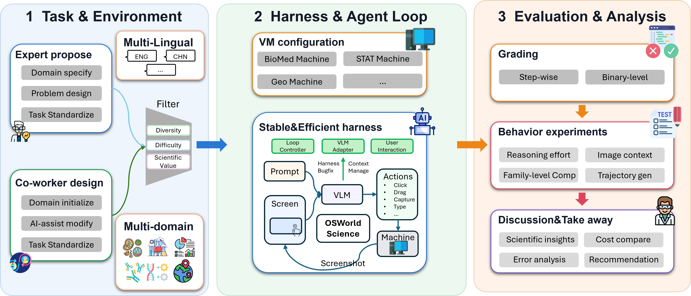

# OSWorld-Science：会操作科学软件，不等于交付了正确研究产物

作者：Dai, Dingyuan、Qi, Heli、Liu, Lei、Li, Yinxi、Chen, Baiding、Dou, Zijun、Zeng, Qingcheng、Kang, Qi、Sun, Oliver、Wang, Eric、Zhou, Bo、Wang, Haixin、Du, Yufan、Bo, Shi、Lin, Ruihan、Yuan, Mengqi、Lu, Dunjie、Dillmann, Steven、Shi, Yiming、Su, Tina、Xin, Amy、Liu, Minghao、Wang, Xi、Huang, Xu、Zhang, Ge、Nie, Pengyu、Yang, Zhen、Tang, Jie、Li, Juanzi、Xuan, Weihao、Liu, Tianyu。arXiv:2609.39903 v1，提交2026-09-30。预印本。

新近创新 / 新近实用；热度待验证。已读核心原文，本站未训练复现。

OSWorld-Science 将计算机使用评测带入七个科学领域：146 个任务，覆盖化学、物理、医学、统计、生物、地理信息和语言学。任务不是看一张图选答案，而是在配置好的虚拟机里操作真实软件，生成可检查的图表、分析文件或其他产物。

评测沿用截图、鼠标和键盘交互；122 个任务允许命令行辅助，24 个要求 GUI。各模型在相同执行框架中工作，通常最多 100 步，保留最近五张截图。多数任务按完成要点给 0—1 的部分分，因此总表的 73.7% 等数值是**平均任务得分**，不能写成 73.7% 的任务全部成功。

作者比较 12 个视觉语言模型，表中 Fable 5.1 平均得分 73.7%，Claude Opus 5 为 57.9%，GPT-6 Astra 为 57.4%。这组排名只对应给定软件、模型版本、思考设置和交互预算。领域数量很不均衡，例如化学 43 题、语言学仅 2 题，整体均值不等于每个科研方向的可靠性。

为什么现在值得看：它让“Agent 能帮科研”落到文件产物与任务步骤上，失败轨迹也可用于排查软件知识、界面定位还是验证能力不足。科学软件许可、账号与虚拟机配置是复现门槛；SAS 等受限环境的轨迹用途需分别遵守原条款。文中环境和 Agent 设置处的分辨率表述也不一致，复现前应核对实际配置，本站不据此填写一个猜测分辨率。

论文作者图 1，CC BY 4.0。先看中间截图—动作—软件状态的闭环，再看右侧分步骤与二元产物评价；这解释了平均部分得分为什么不等于完整成功率。（[作者原图](https://arxiv.org/abs/2609.39903v1)；[查看大图](../../../frontiers/2026/10/2026-10-02/images/osworld-science.png)。）

[原始论文](https://arxiv.org/abs/2609.39903v1) · [版本许可](http://creativecommons.org/licenses/by/4.0/)

原文为CC BY 4.0，保存未改动的v1 PDF并保留作者和许可。
[归档PDF](2609.39903v1.pdf)

[返回本期论文精选](../../../frontiers/2026/10/2026-10-02/03-论文精选.md)
