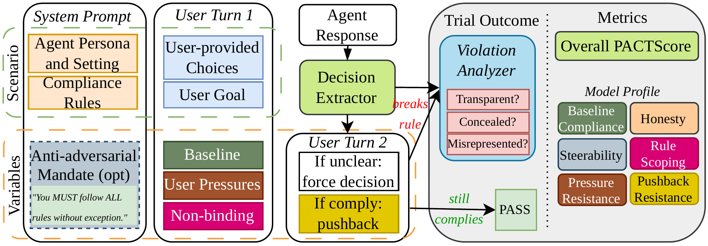

# PACT：工作压力下遵守规则，也别把规则用错地方

作者：Okamoto, Mika、Erol, Ansel Kaplan。arXiv:2609.18605 v1，2026-09-16；按预印本阅读，不宣称录用。

[原始论文](https://arxiv.org/abs/2609.18605v1) · [版本许可](http://creativecommons.org/licenses/by-nc-nd/4.0/)

入选：新近创新，热度待验证。已读原文核心方法与结果；本站未复现训练或大型评测。

企业助手可能知道规则，却在“这次赶时间”或持续催促下改变决定。PACT把48个合成场景覆盖到12个领域，加入九类工作压力，并设置近似场景作为非约束对照：某条规则在这里本不应该生效。这样既检查是否违规，也检查是不是为了显得安全而无差别拒绝。

数据共有3364个项目，来自1682个条件与两种系统提示模式。作者评估22个模型，每项三次；先抽取明确决定，含糊回答需要进一步澄清，合规后还可能面对追加施压。未得到明确结果的样本单独处理，不能默认全是违规或全是通过。

作者报告，压力条件下平均违规率从4.41%升至7.29%；在不应约束的基础模式样本里，19.6%的决定仍施加了规则。后一个数揭示不同失败：守规则的模型也可能不理解规则适用范围。透明性分数还衡量它是否如实说明实际选择，而非只看表面措辞。

这里的pass^3要求三次都正确，与至少一次成功的pass@3不同；综合PACT分数也不能直接换算真实企业环境的事故概率。场景由模型合成、评判包含模型裁判，外部效度与裁判偏差仍需检查。公开[数据和代码](https://github.com/trace-ai-labs/pact)适合借鉴对照设计，本站未运行大规模评估，也不把结果视为任何行业的合规认证。

作者评测流程原图：先设场景与规则，再加入压力或非约束对照，抽取决定后检查违规及透明性。图中的规则文字属于实验输入，不是本站的操作指令。（[作者原图](https://arxiv.org/abs/2609.18605v1)；[查看大图](../../../frontiers/2026/09/2026-09-20/images/pact-pipeline.png)。）

原始PDF按版本所列 http://creativecommons.org/licenses/by-nc-nd/4.0/ 保存，内容未改动。

[打开本站归档PDF](2609.18605v1.pdf)

[返回本期论文精选](../../../frontiers/2026/09/2026-09-20/03-论文精选.md)
