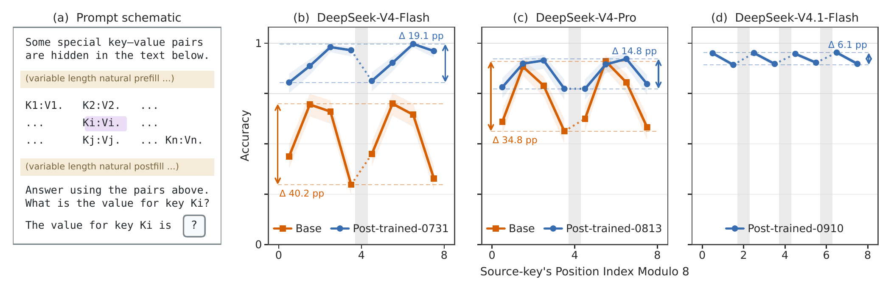

# 压缩KV缓存：同一条信息换个位置就可能更难取回

作者：Zhu, Xingyu、Pu、Yi、Cheng, Ziheng、Lv, Ang、Liu, Jing、Ying, Lexing、Ma, Yiyuan、Dong, Xin。arXiv:2609.36322 v1，提交2026-09-28。预印本。

新近创新 / 新近实用；热度待验证。已读核心原文，本站未训练复现。

KV缓存保存模型读过的内容，分块压缩能省资源，却给每个token多了一个坐标：它落在压缩窗口的哪个位置。论文固定查询和信息内容，只改变前面的填充长度，观察检索随位置余数变化，称为“相位敏感性”。

128K单token键值检索中，DeepSeek-V4-Flash基座不同相位的最大差距为40.2个百分点；后训练减弱了差距，但未完全消除。作者另从头训练Qwen3派生小模型，以全注意力为对照，分别改变窗口与步长：周期更贴近压缩步长，而非绝对文本位置。因果干预进一步观察不同注意力组件对相位的分工。

为什么现在值得看：如果只报一个平均召回率，就可能漏掉固定边界附近的失败。复核时可保持长度、查询位置和目标绝对位置分布一致，再按位置取模分组。研究覆盖特定压缩架构及合成检索，不能推断全部长上下文模型都有同样差距；理论论证也依赖理想化嵌入几何，不是一般模型的普遍定理。

作者Figure 2原图，显示位置模8分组的检索准确率。灰带对应步长边界，阴影是95% Wilson区间；比较同一个模型内部的起伏，不把基座与后训练的差值混成水平均值。（[作者原图](https://arxiv.org/abs/2609.36322v1)；[查看大图](../../../frontiers/2026/10/2026-10-01/images/phase-retrieval.png)。）

[原始论文](https://arxiv.org/abs/2609.36322v1) · [版本许可](http://creativecommons.org/licenses/by/4.0/)

原文为CC BY 4.0，保存未改动的v1 PDF并保留作者和许可。
[归档PDF](2609.36322v1.pdf)

[返回本期论文精选](../../../frontiers/2026/10/2026-10-01/03-论文精选.md)
