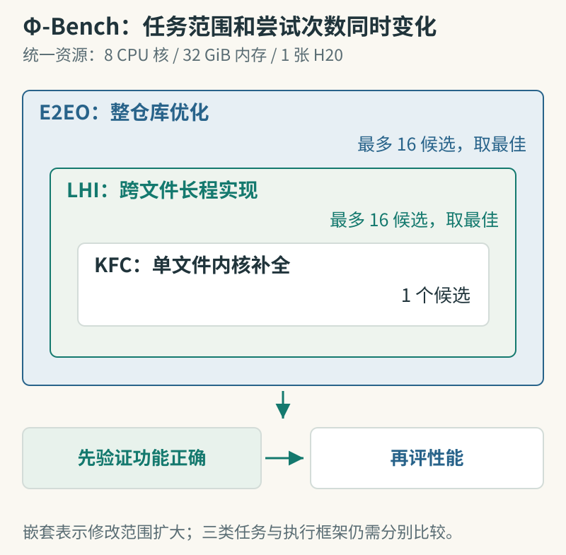

# Φ-Bench：从写内核扩展到维护推理基础设施

[arXiv:2609.10226v1](https://arxiv.org/abs/2609.10226v1)，2026-09-09 提交，v1 预印本。阅读记录日期：2026-09-11。

原题：Φ-Bench: Can Large Language Models Engineer the Infrastructure That Powers Them?。

作者：Leilei Ding、Shumin Wang、Yuting Huang、Fanqi Wan、Yinmin Zhang、Qi Han、Yiming Xu、Feiyuan Zhang、Xiaomeng Chu、Guoliang You、Wuyang Zhang、Daxin Jiang、Yanyong Zhang。

## 研究问题与摘要

Φ-Bench 想测的是：模型能否进入真实基础设施仓库，定位问题、实现功能并优化系统。它区分单文件内核补全、跨文件长程实现、整仓库端到端优化三种任务。功能正确之后才比较性能，因此不能只生成看起来像 CUDA 的代码。

评测为每项任务分配 8 个 CPU 核、32 GiB 内存和一张 H20。内核任务提交一次，另两类最多提交 16 个候选并取最佳；GPT-5.6 Sol 使用 Codex，其余模型使用 Claude Code。论文报告 Claude Opus 5 总分为 36.53%，其中长程实现为 21.60%。这些是基准得分，不应一概解释为任务通过率。

它提供了比孤立算子更接近工程工作的环境，但不同执行框架、固定 GPU 和多次挑选都影响比较。榜单同时反映模型与其工作方式，不能据此断言某个模型能独立维护任意生产推理集群。

图：嵌套只表达工作范围扩大；KFC、LHI、E2EO 仍是三类独立任务。本站依据[论文实验设置](https://arxiv.org/html/2609.10226v1)绘制，图中“最多 16”是多次候选选择预算。不同 Agent 执行框架等条件还需结合正文。

## 原文怎么读

第一个阅读重点是 Task Formats：KFC 给定目标函数，LHI 给定功能要求但允许跨文件实现，E2EO 只给系统目标与约束。它们开放的修改范围不同，提交预算也不同。把三类结果放在一起时，需同时检查评分方法与权重。

第二个重点是实验设置。统一 H20 限制了硬件差异，却也使结果更依赖该设备的内存、算子和带宽特性。允许 16 次提交后取最佳，测的是一段优化过程的最终能力，不等于单次生成成功概率。

可以挑一项公开内核任务，先固定正确性测试与性能测量脚本，再记录每轮修改和用时。更大范围的性能优化还要检查是否改变精度、输入覆盖或语义。本站未运行基准；作者及标题依据 arXiv 摘要页，避免沿用 HTML 转换中丢失首位作者的文本。

## 原文与归档

[原始 PDF](https://arxiv.org/pdf/2609.10226v1) · [HTML](https://arxiv.org/html/2609.10226v1)。本页是原创阅读笔记；未核实本站全文再分发许可，因此归档原创阅读卡，保留 arXiv 原文及固定版本 PDF 入口。

[返回 9 月 11 日论文精选](../../../frontiers/2026/09/2026-09-11/03-论文精选.md)
