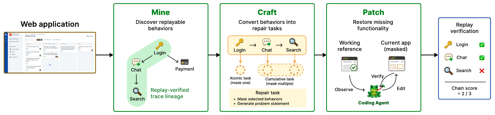

# ProgramDistill：用可重放的应用行为生成修复任务

作者：Kim, Jeonghye、Kim, Minseon、Kim, Young Jin、Pereira, Matheus、Côté, Marc-Alexandre、Sordoni, Alessandro、Yuan, Xingdi、Shi, Zhengyan。arXiv:2609.18805 v1，2026-09-16；本期按预印本阅读，不宣称已录用。

[原始论文](https://arxiv.org/abs/2609.18805v1) · [版本许可](http://arxiv.org/licenses/nonexclusive-distrib/1.0/)

入选：新近创新。已读原文方法与实验；本站未复现。

给Agent看一个网站，让它照着重建，怎样判断真的完成？ProgramDistill把问题拆成mine、craft、patch：先探索应用中可重放的行为，记录操作和前置依赖；再遮蔽部分实现生成任务；最后要求Agent参考正常应用修复，并重放原行为验证。目标是恢复行为，代码不必逐字相同。

作者在26个自包含Web应用中提出2800个目标，得到1975条通过最终重放检查的行为，再构造4063项修复任务。无效或不可稳定重放的过程被排除，不能把提出的目标数直接写成可靠测试数。部分任务仅缺单个行为，另一些缺失完整依赖链。

局部修复评测选定300项任务，对比九种系统；随着恢复链加深，成功率下降。与之不同，完整应用重建从最小可执行骨架开始，在12个应用中用590项原子行为测试和413条累积流程测试验收。Astra与Opus5的累积成功比例分别约49.2%和28.8%，不能与局部修复的较高分数混写。

图中登录、聊天、搜索依次恢复到第二步，链分数可获2/3，但整条流程的二元成功仍不通过。这一区分比“页面看起来像”更接近有状态软件的实际可用性；同样，观测次数更多也未保证恢复行为更多。

实验Agent读取的是可见文字、无障碍信息和可交互元素等结构化浏览器观测，没有配套截图输入；视觉保真也不在现有行为检查覆盖内。外部服务、随机状态、桌面和移动应用尚需扩展。方法适合授权的软件测试与修复，价值是构建和验收链条，不能把演示相似度当完整产品复制能力。

作者流程原图：挖掘带依赖的行为、遮蔽成任务、参考原应用修复，最后重放。右端2/3是前缀恢复的部分分数，搜索仍失败，整条流程并没有完成。（[作者原图](https://arxiv.org/abs/2609.18805v1)；[查看大图](../../../frontiers/2026/09/2026-09-18/images/paper-programdistill.png)。）

原版本仅授予 arXiv 非独占分发权，本站不再分发全文 PDF；原图限本条研究评论所需引用。

[返回本期论文精选](../../../frontiers/2026/09/2026-09-18/03-论文精选.md)
