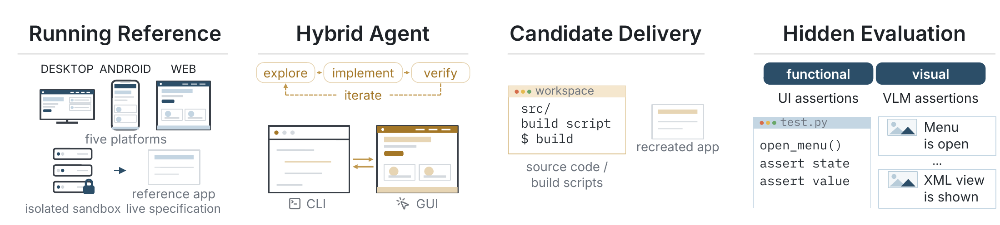

# RecreationWorld：能仿出界面，不代表仿出了应用

作者：Bai, Shuai、Deng, Jiayong、Fu, Yikun、Gao, Chang、Hu, Xuhao、Huang, Mianqiu、Jiang, Yizhen、Jing, Yuheng、Kong, Dehui、Li, Keliang、Li, Ning、Li, Wanli、Liu, Dayiheng、Lu, Dunjie、Luo, Changwei、Shen, Que、Wang, Zheyuan、Wang, Zijian、Wu, Jie、Wu, Gao、Xie, Zhihui、Xie, Rui、Xu, Haiyang、Yang, An、Yuan, Jiakang、Zhang, Yanming、Zhang, Jiajun、Zhang, Xi、Zhang, Zhenru、Zhen, Zhuo、Zhu, Mingkang、Zhou, Bowen。arXiv:2609.22000 v1，2026-09-18。预印本，未宣称录用。

入选：新近创新；热度待验证。已读核心原文，本站未复现。

RecreationWorld 要求 Agent 操作一个参考应用，再写出可运行的重建版本。它必须在观察界面、编写代码、运行成品和检查反馈之间来回切换，不能只交一张相似截图。任务覆盖 Ubuntu、macOS、Windows、Android 和 Web；最终产物按各平台的构建与启动约定交付。

参考程序既是可操作的规格，也是构造隐藏测试的依据。程序断言检查文字、状态和计算结果，视觉断言补充布局等属性；候选断言先在参考程序上跑通，并经人工检查后冻结。Web 的客户端源码天然可见，和桌面、移动端的源码不可见条件不同，论文没有假装所有平台信息完全对等。

RecreationBench 有 250 个任务，每平台 50 个。GPT-6 Astra 的总体分数为 58.06%，但通过全部程序断言的任务只有 2.8%。前者是聚合后的局部保真度，后者是严格完整通过，两个分母和聚合方式不同，绝不能写成“成功复刻约六成应用”。静态界面通常比交互链和计算输出容易还原。

作者也用重建轨迹训练两种模型并观察迁移收益，但轨迹中的行为关联不等于因果证据。测试只覆盖有限状态，公开应用可能已进入预训练；固定环境也减少了在线服务和真人交互的不确定性。它的实用启示是把最终可运行产物、跨状态行为和视觉验证一起纳入检查。

作者 Figure 2。左侧参考应用提供可观察行为，中间是反复探索与实现，右侧用隐藏行为和视觉断言检查交付物。图中的闭环解释了为什么漂亮截图不足以代表任务完成。（[作者原图](https://arxiv.org/abs/2609.22000v1)；[查看大图](../../../frontiers/2026/09/2026-09-22/images/recreation-method.png)。）

[原始论文](https://arxiv.org/abs/2609.22000v1) · [版本许可](http://arxiv.org/licenses/nonexclusive-distrib/1.0/)

此版本采用 arXiv 非独占分发许可，不能据此推断本站获准再分发全文；本站只保存阅读卡，PDF 请到原站阅读。方法图在本页针对性技术评论中作有限引用，未改动数据或关系，不表示可任意再分发。
[返回本期论文精选](../../../frontiers/2026/09/2026-09-22/03-论文精选.md)
