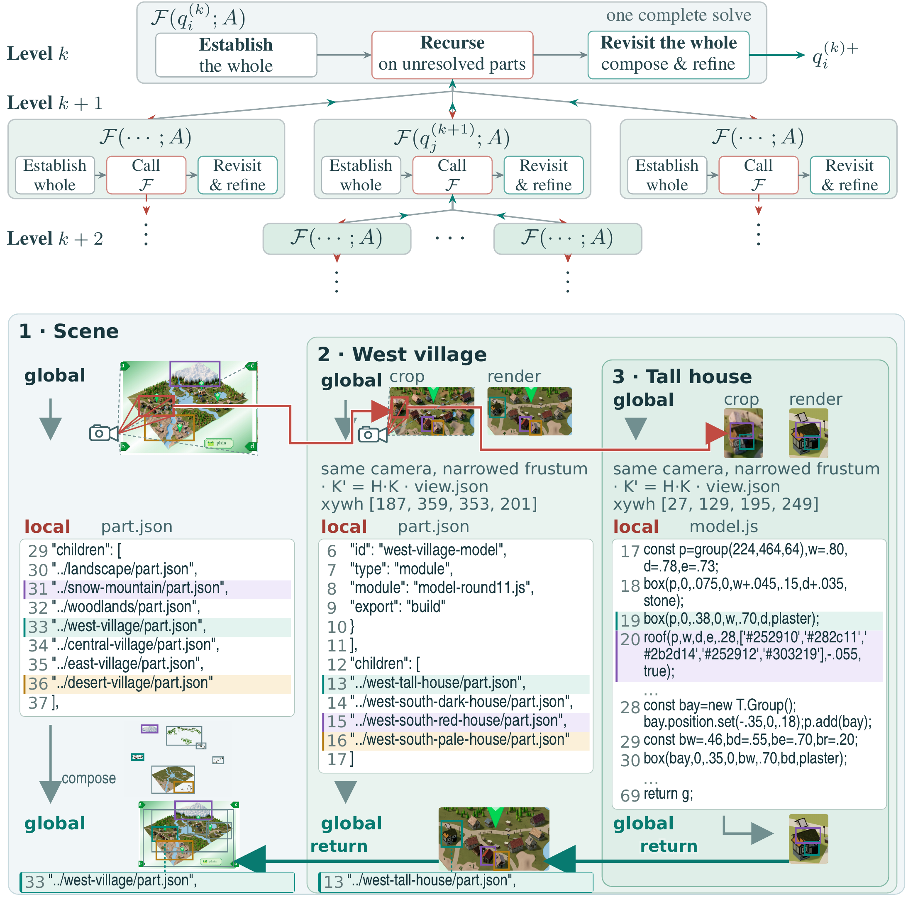

# Recursive Code World Models: Building Complex Worlds through Recursive Scene Programs

**2026-09-10 · arXiv 2609.11499v1 · 预印本。** 作者：Li, Zhiqi; Liao, Yuxuan; Zhu, Bo。

同一个视觉语言求解器，怎样在整体与局部之间往返。

一次让模型写出整个复杂场景的 Three.js 程序，容易出现建筑大致对、局部比例错的问题。RCWM 把场景写成嵌套程序：先搭整体，再为局部建立子问题，最后回到父层检查组合是否仍一致。同一个冻结的视觉语言求解器在不同层级重复使用，并不需要给每个物体单独训练模型。

关键步骤是把局部参考与渲染结果放到可比较的相机条件下。系统在指定区域内继续细化程序，然后把修改后的子场景放回整体。递归带来更细的修改单位，但同时增加模型调用与渲染次数，因此不能只比较最终截图而忽略计算预算。

论文用五个完整场景及五个局部裁图形成十个参考案例，主实验使用 GPT-6 Astra high，各案例只运行一次。作者报告十项中 PSNR 和 LPIPS 均领先，SSIM 在九项领先；Valley Village 的 SSIM 仍低于 VIGA。部分对照按论文规定继续执行，比较结果受具体预算和停止规则影响。

它证明的是小规模条件下，用递归程序改善图像对齐的可行性。单张图片看不到的背面、真实尺寸与物理属性仍不确定，像素相似也不能证明三维世界正确。复现时可先固定相机、调用预算与随机种子，再检查局部改好后是否破坏整体。

Zhiqi Li 等的方法原图。沿上到下看问题如何细分，再沿返回路径看子程序如何组合；每一层复用求解流程。图中的场景是作者案例，不是本站生成结果。（[论文原图](https://arxiv.org/abs/2609.11499v1)；[查看大图](../../../frontiers/2026/09/2026-09-14/images/paper-rcwm.png)。）

来源：[arXiv 版本页面](https://arxiv.org/abs/2609.11499v1)。

## 版本与归档

arXiv 页面的许可为 non-exclusive distribution，未确认允许本站再分发全文，故仅归档阅读卡。请通过原始链接阅读 PDF。为讲解方法引用一幅原图，不表示整篇论文获得再分发许可。

本卡依据 v1 的方法、实验及限制整理，阅读日期为 2026-09-14，未复现训练或评测。原图仅栅格化为 PNG，未改写数据和关系。
