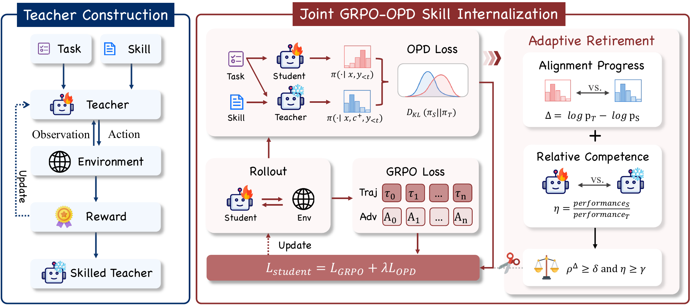

# RetireOPD：老师什么时候应该退出训练

作者：Yu, Yan、Lu, Zhengxi、Liu, Yizhou、Pan, Yichen、Wang, Aozhe、Chen, Qipeng、Yang, Hua、Zhang, Wenqi、Lu, Weiming、Chen, Qianglong、Shen, Yongliang。arXiv:2609.20784 v1，2026-09-17；按预印本阅读，不宣称录用。

[原始论文](https://arxiv.org/abs/2609.20784v1) · [版本许可](http://creativecommons.org/licenses/by/4.0/)

入选：新近创新，热度待验证。已读原文核心方法与结果；本站未复现训练或大型评测。

RetireOPD关心蒸馏的后半程：老师能提供细粒度指导，但学生接近老师后，持续模仿可能限制进一步探索。作者先给老师额外的技能知识，再训练学生从自己的交互轨迹学习，结合任务奖励与较小权重的蒸馏信号。

退出不是固定跑多少步。方法同时检查老师与学生的对数概率差是否长期停滞，以及学生任务表现是否达到老师一定比例；满足门槛后停止蒸馏，保留纯强化学习。原图左边的技能教师、中间的联合学习、右边的退出开关应连起来读，前期准备老师本身也需要计算。

主实验使用Qwen2.5的1.5B、3B和7B，在ALFWorld与WebShop两个环境比较。3B的ALFWorld由GRPO基线75.0升到93.8，1.5B的WebShop由56.8升到75.8，分别是18.8与19.0个百分点。某个退出消融表中的92.2属于另一设置，不能与主表93.8混为同一运行。

这些结果支持在所测任务里考察退出机制，不说明任意老师、任务和阈值都有效。两个模拟环境与额外技能教师的成本限制了外推；本站未复现训练，论文关联[作者实现仓库](https://github.com/ZJU-REAL/SDAR)，应按其版本与训练配置检查。实用的研究问题是：模仿的收益何时结束，后续进步来自探索还是预算差异？

作者方法图，CC BY 4.0：先构造有技能帮助的教师，再进行任务奖励与蒸馏联合学习，条件满足后退役教师。右侧退出条件依赖能力与概率差的变化，不能简化为固定步数。（[作者原图](https://arxiv.org/abs/2609.20784v1)；[查看大图](../../../frontiers/2026/09/2026-09-19/images/retireopd-method.png)。）

原始PDF按版本所列 http://creativecommons.org/licenses/by/4.0/ 保存，内容未改动。

[打开本站归档PDF](2609.20784v1.pdf)

[返回本期论文精选](../../../frontiers/2026/09/2026-09-19/03-论文精选.md)
