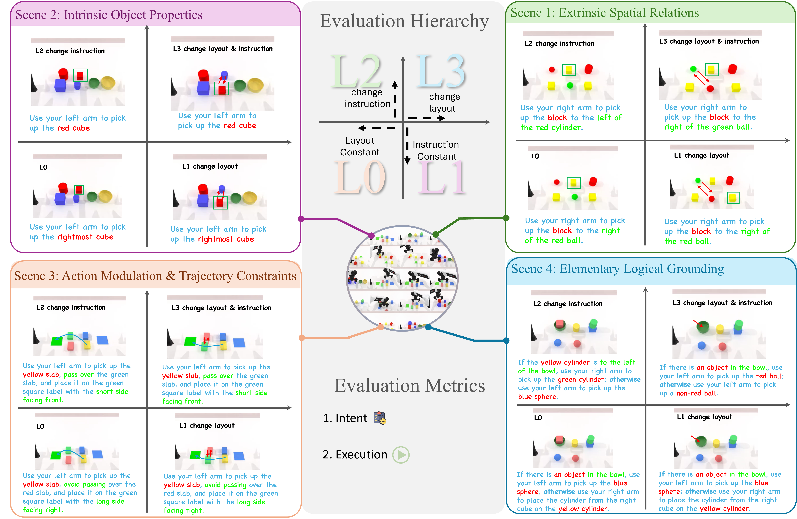

# RoboFollow：机器人是在听指令，还是只认场景

作者：Guo, Chang、Xie, Yukun、Tan, Bohan、Chang, Zheng、Yin, Zhaokai、Ma, Qianli、Wang, Yingqiao、Liang, Chao、Zhang, Zhipeng。arXiv:2609.25636 v1，2026-09-22。预印本。

新近创新 / 新近实用；热度待验证。已读核心原文，本站未复现。

如果桌上只有一个杯子，机器人拿对它，不能证明听懂了“拿起红杯”。RoboFollow 让相同或相近场景对应多个合理任务，必须依靠语言才能选中目标。四类场景覆盖外部空间关系、物体属性、动作路径和简单逻辑，共 75 个训练任务、3,750 条示范。

L0 按训练分布测试；L1 保持指令但交换物体位置；L2 保持布局却重组熟悉的语义属性；L3 两者都改变。这四级分离不同泛化问题，并非严格递增的难度梯。评分再区分选对语义目标的 Intent 和真正完成动作的 Execution，避免把没抓稳与理解错误混在一起。

作者微调并比较九种 VLA/WAM。空间场景中，π0.5 的 Intent 从 L0 的 99.1% 降到 L1 的 45.5%；π0 在同项从 98.2% 到 0%。但这只针对规定场景与训练过程，不能推成这些模型在所有真实任务都不理解语言。实机先导试验训练指令 20/40 成功、未见指令 6/40，两组指令与动作组成不同，也不是完全配对对照。

换更强视觉语言底座、QA 联合训练或放大语言引导，并未在所测设置中消除缺口。新近创新在于把“场景泄漏了任务答案”变成可控制的测试条件。复现应先固定训练布局与保留组合，不能把 L1 测试布局加回训练后仍称原来的泛化评测。

作者四场景总览（Figure 1）。横向比较空间、属性、路径、逻辑要求，再对照 L0–L3 如何单独改变图像与指令；中文正文逐项解释。CC BY 4.0，保留完整图。（[作者原图](https://arxiv.org/abs/2609.25636v1)；[查看大图](../../../frontiers/2026/09/2026-09-24/images/robofollow-scenes.png)。）

[原始论文](https://arxiv.org/abs/2609.25636v1) · [版本许可](http://creativecommons.org/licenses/by/4.0/)

版本采用 CC BY 4.0，保留作者与版本归属。
[归档 PDF](2609.25636v1.pdf)

[返回本期论文精选](../../../frontiers/2026/09/2026-09-24/03-论文精选.md)
