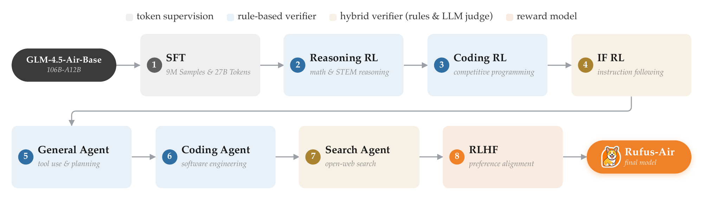

# Rufus-Air：把多种后训练目标排成可检查的阶段

作者：Chang, Chia-Yuan、Cheng, Renyuan、Feng, Rui、Han, Xiaotian、He, Yuan、Jin, Hongye、Li, Linwei、Li, Shiyang、Liu, Fenglin、Liu, Xin、Nigam, Priyanka、Wen, Haoyang、Xu, Zhenghao、Xu, Zhuocheng、Yin, Bing、Yin, Qingyu、Zhang, Chao、Zhang, Rongzhi、Zhang, Zhihan、Zhang, Zixuan、Zhang, Zixuan、Zhao, Tuo。arXiv:2609.29421 v1，首发2026-09-24。预印本。

新近创新 / 新近实用；热度待验证。已读核心原文，本站未复现。

一个Agent既要答对问题，又要调用工具、写代码并遵循指令，不同奖励可能互相拉扯。Rufus-Air从GLM-4.5-Air-Base出发，模型总参数106B、激活约12B，按八个阶段依次做监督训练、推理、代码、指令、通用Agent、编码Agent、搜索Agent与偏好优化。

这套顺序的动机是先用相对可靠的可验证奖励建立能力，再进入环境和偏好更复杂的目标。训练还筛选任务可学性，排除部分过易或几乎无法得到有效反馈的题；有状态工具任务通过RufusGym承接。它是一套需要分布式训练与沙箱环境的工程流程，不能按激活参数把部署或训练成本简单算成12B小模型。

作者在自己的评测框架下比较同基座模型及其它系统，多项指令和Agent指标得到改善，也有创意写作等项目落后。阶段分析显示指令训练后MultiChallenge上升24.7个百分点，最终偏好阶段改善创意写作；但不同阶段表格的协议并非处处相同，不能任意跨行相减，再把差额归给单个阶段。

新近实用性在于暴露训练组成、环境和能力取舍，供研究者设计对照。八阶段顺序并未被证明全局最优；有些后续阶段可能损伤先前能力。复现应固定评测协议，保留每阶段检查点和失败轨迹，并把沙箱、检索与判分器成本一并计算。本站未运行训练，结论限作者报告。

Amazon作者的训练流程原图。八个连续阶段对应不同的数据和奖励来源；箭头表示训练先后，不表示每一步都会让所有能力一起提高。请结合正文的阶段评测条件阅读。（[作者原图](https://arxiv.org/abs/2609.29421v1)；[查看大图](../../../frontiers/2026/09/2026-09-26/images/rufus-pipeline.png)。）

[原始论文](https://arxiv.org/abs/2609.29421v1) · [版本许可](http://arxiv.org/licenses/nonexclusive-distrib/1.0/)

arXiv非独占分发许可不直接授权本站再分发全文，因此仅归档阅读卡与原站链接；单幅原图限本条方法或实验评论引用。
[返回本期论文精选](../../../frontiers/2026/09/2026-09-26/03-论文精选.md)
