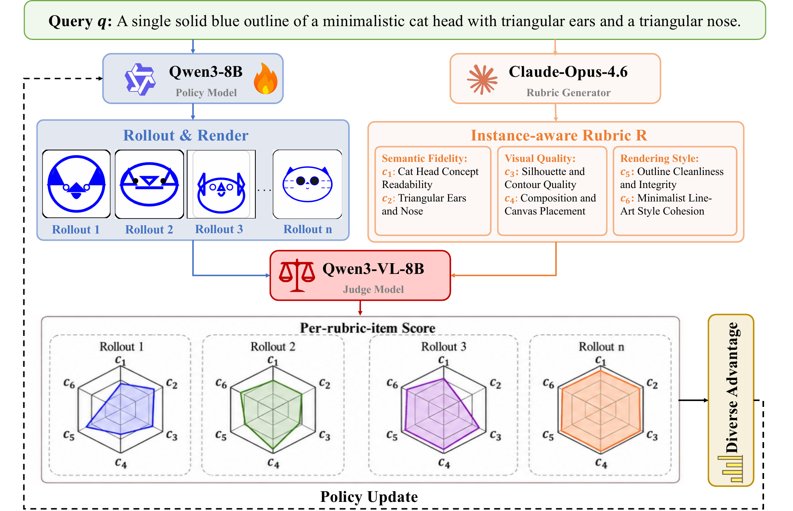

# RULER：先说明好图的标准，再训练 SVG 生成

作者：Ran, Hangyu、Zheng, Yuhao、Zhang, Yingying、Lin, Kevin Qinghong、Peng, Han。arXiv:2609.25270 v1，2026-09-21。预印本。

新近创新 / 新近实用；热度待验证。已读核心原文，本站未复现。

同一个“美观分”很难同时评价极简图标与复杂插画。RULER 为每条绘图指令生成六项标准，覆盖语义、视觉质量和风格三个方面。模型生成 SVG 后先渲染成图，再由视觉语言裁判逐项打分，按权重合成奖励，用 GRPO 更新生成模型。标准描述设计意图，不要求复刻一张唯一参考图。

主实验以 Qwen3-8B 为生成底座，在 MMSVG 的 Illustration 与 Icon 上，用独立的 GPT-5-mini 通用量表评估。相对未训练底座，量表分分别从 0.432、0.395 到 0.693、0.683。150 条提示的盲评中，相对各基线的非平局胜率超过 50%；最低对手比较为 53.3%，不宜概括成压倒性优势。

最有价值的是奖励消融：仅混合 CLIP、美学和人类偏好分，可能把图标变成密集笔画，分数升高而语义变差；更严格的另一种量表又诱发把提示词写进图里走捷径。量表不是写得越细越安全，标准之间需要互相补足。

新近创新在于让奖励与具体任务对齐，并检查奖励投机；实用门槛是每轮要渲染、调用外部裁判，费用高于轻量分数。结论仍受生成量表模型和裁判偏好影响，只验证了 SVG 等指定分布，不能直接替代真实用户的审美判断。

作者方法总览（Figure 2）。先看右侧六项量表，再看左侧生成和渲染如何送入下方裁判与策略更新，注意裁判看到的是渲染图。原图未重绘，限方法评论引用。（[作者原图](https://arxiv.org/abs/2609.25270v1)；[查看大图](../../../frontiers/2026/09/2026-09-24/images/ruler-framework.png)。）

[原始论文](https://arxiv.org/abs/2609.25270v1) · [版本许可](http://arxiv.org/licenses/nonexclusive-distrib/1.0/)

版本采用 arXiv 非独占分发许可，本站不据此再分发全文，只保留阅读卡和原站链接；方法图仅限本条技术评论引用，未改动关系或数据。
[返回本期论文精选](../../../frontiers/2026/09/2026-09-24/03-论文精选.md)
