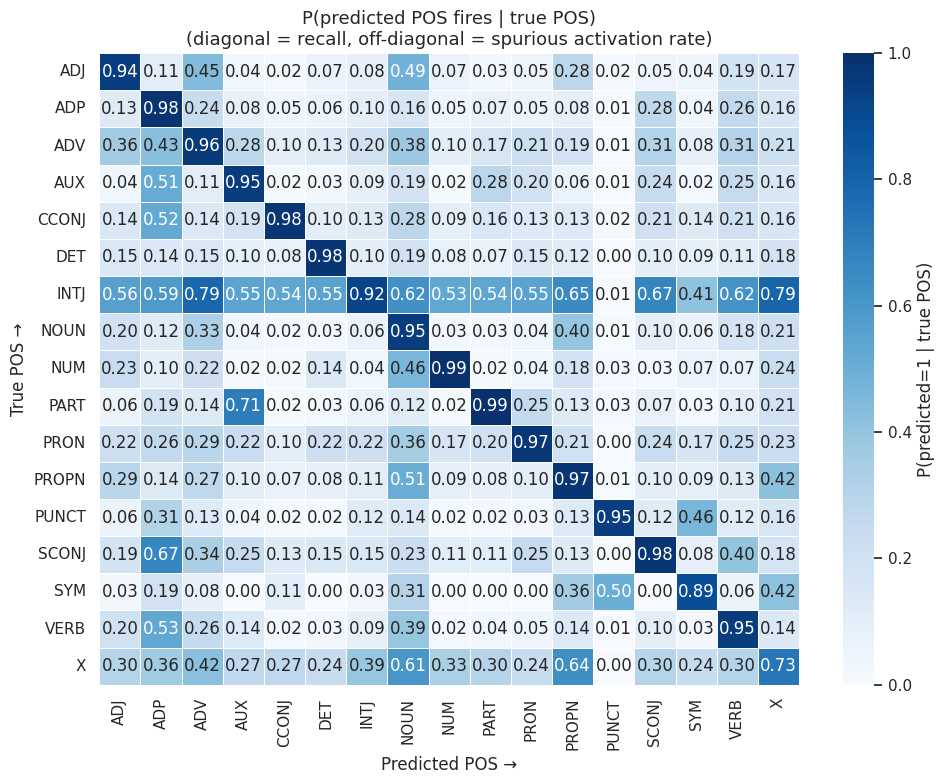

# 词性与SAE：能预测一个概念，不代表找到专属神经元

作者：Bondielli, Alessandro、Passaro, Lucia、Auriemma, Serena、Lenci, Alessandro。arXiv:2609.29362 v1，首发2026-09-24。预印本。

新近创新 / 新近实用；热度待验证。已读核心原文，本站未复现。

原文首页注明这是将收入ENLSP 2026论文集的预印本；本期未另核会议录用列表。论文用词性作为可检查的语言学目标，研究SAE稀疏特征是否对应名词、动词等类别。设置为LLaMA3-8B第30层、131072个SAE潜变量，以及含17类词性的英语GUM语料；通过带L1约束的线性探针寻找少量特征组合。问题不是能否给潜变量起一个好听名称，而是这些组能否在没见过的词上仍有区分力。

达到95%覆盖所需的各类特征并集约498个，约12%跨类别共享。留出测试中，选出特征组的准确率约0.89、macro-F1约0.81；原始层表示对照约0.92、0.84。SAE提供更稀疏的描述，并没有在这个设置中自动带来更高分类准确率。

核心限制在非专一性：对角线显示目标词性召回较高，但非对角线也有不少激活。在控制词汇的180项模板实验中，所选组召回约0.937、精确率约0.192，说明许多“会响”的特征并非只为该词性而响。读出信息也不等于因果控制；论文没有因此证明干预某组就能可靠改变语法行为。

本期还发现原文正文与对照表的macro-F1有不一致：正文一处写0.97，对照表对应值为0.78。这里保留缺口，采用明确的表格口径，不引用0.97作效果宣传。新近价值是可复用的诊断思路；结论仍限一个模型、层、SAE与英语语料，未证明所有语言或架构都如此。

Alessandro Bondielli等人的留出集共激活原图（图6，CC BY 4.0）。每行是真实词性，每列是某组特征触发；对角线是召回，非对角线是其他类别上的触发率。这不是每行加总为1的普通互斥分类混淆矩阵，不能按那种方式读数。（[作者原图](https://arxiv.org/abs/2609.29362v1)；[查看大图](../../../frontiers/2026/09/2026-09-27/images/sae-coactivation.png)。）

[原始论文](https://arxiv.org/abs/2609.29362v1) · [版本许可](http://creativecommons.org/licenses/by/4.0/)

采用CC BY 4.0，归档未改动的原版PDF，保留作者、版本和许可。
[归档PDF](2609.29362v1.pdf)

[返回本期论文精选](../../../frontiers/2026/09/2026-09-27/03-论文精选.md)
