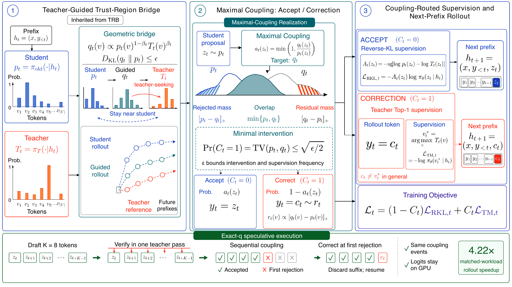

# SAKI：老师真正介入的位置，应该接受不同监督

作者：Wei, Miteto、Wang, Xiaohan、Chen, Zehao、Chai, Jiajun、Liu, Sichao、Wang, Li、Xu, Haoyuan、Hu, Zhaoyu、Lin, Wei、Yin, Guojun。arXiv:2609.36601 v1，提交2026-09-29。预印本。

新近创新 / 新近实用；热度待验证。已读核心原文，本站未训练复现。

学生自己生成的轨迹能减少训练与推理的分布错位，但弱学生容易早早走偏。SAKI先在学生附近构造教师引导分布，再用最大耦合尽可能保留学生提议：能保留的位置沿用reverse-KL监督，需要修正的位置改为学习教师概率最高的token。

要分清两件事：残差分布抽出的token决定后续轨迹，教师Top-1决定当前训练目标；二者一般不相同。理论上修正概率等于两个分布的总变差距离，给出了介入量的明确含义，而非另设一个经验阈值。

实验将Qwen3的0.6B和1.7B学生从同一个4B教师蒸馏，使用相同200步预算和七组数学测试。1.7B相对TRB的宏平均Mean@8从27.9到29.0，Pass@8从44.6到47.5。引擎内验证比外部循环快4.22倍，但仍慢于纯学生生成，不能说教师验证没有成本。

为什么现在值得看：它把“在哪些token上教”变成可控、可对照的机制。本站[技术实践](../../../frontiers/2026/10/2026-10-01/05-技术实践.md)只运行四token分布的耦合实验，帮助理解采样，不冒充论文训练复现。结论目前主要在小模型数学蒸馏上成立，泛化到其他任务尚待验证。

作者Figure 1原图。上方依次看引导分布、接受或修正、监督分流；修正token与教师Top-1的不同用途是关键。底部4.22倍只比较匹配工作负载下的两种实现。（[作者原图](https://arxiv.org/abs/2609.36601v1)；[查看大图](../../../frontiers/2026/10/2026-10-01/images/saki-method.png)。）

[原始论文](https://arxiv.org/abs/2609.36601v1) · [版本许可](http://creativecommons.org/licenses/by/4.0/)

原文为CC BY 4.0，保存未改动的v1 PDF并保留作者和许可。
[归档PDF](2609.36601v1.pdf)

[返回本期论文精选](../../../frontiers/2026/10/2026-10-01/03-论文精选.md)
